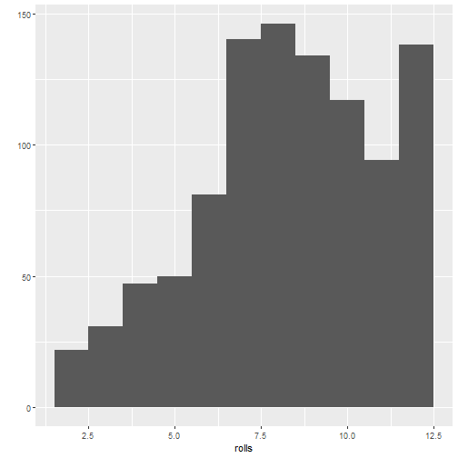

### The Very Basics


```r
# Ex2.1 (Magic with numbers)

(((14 +2) * 3) - 6) / 3
```

```
## [1] 14
```


```r
# - 2.4 Writing Your Own Functions
# -- 2.4.1 The Function Constructor

# Roll function
roll <- function() {
  die <- 1:6
  dice <- sample(die, size = 2, replace = TRUE)
  sum(dice)
}
```


```r
# Ex 3.1 (Visualize a Histogram) Let x3 be the following vector:

x3 <- c(0, 1, 1, 2, 2, 2, 3, 3, 4)

ggplot2::qplot(x3, binwidth = 1)
```


```r
# Ex 3.2 (Roll a Pair of Dice) 
# Rewrite the roll function below to roll a pair of weighted dice:

# You will need to add a prob argument to the sample function inside of roll. 
# This argument should  tell sample to sample the numbers one through five with 
# probability 1/8 and the number 6 with probability 3/8.

roll <- function() {
  die <- 1:6
  dice <- 
   sample(
     die,
     size = 2,
     replace = TRUE,
     prob = c(1/8, 1/8, 1/8, 1/8, 1/8, 3/8)
   )
  sum(dice)
}
```


```r
# Visualize weighted rolls of weighted dice

rolls <- replicate(1000, roll())
ggplot2::qplot(rolls, binwidth = 1)
```



### 4 Project 2: Playing Cards

Task 1: build the deck

Task 2: write functions that deal and shuffle

Task 3: change the point system to suit your game

Task 4: manage the state of the deck


### 5 Objects


```r
# Exercise 5.2 (Vector of Cards) 
# Create an atomic vector that stores just the face names of the cards in a 
# royal flush, for example, the ace of spades, king of spades, queen of spades, 
# jack of spades, and ten of spades. The face name of the ace of spades would 
# be “ace,” and “spades” is the suit.
# Which type of vector will you use to save the names?

hand <- c("ace", "king", "queen", "jack", "ten")

typeof(hand)
```

```
## [1] "character"
```


```r
# 5.2.1 Names

die <- 1:6
attributes(die)
```

```
## NULL
```


```r
names(die) <- c("one", "two", "three", "four", "five", "six")
attributes(die)
```

```
## $names
## [1] "one"   "two"   "three" "four"  "five"  "six"
```

```r
die
```

```
##   one   two three  four  five   six 
##     1     2     3     4     5     6
```


```r
die + 1
```

```
##   one   two three  four  five   six 
##     2     3     4     5     6     7
```


```r
names(die) <- c("uno", "dos", "tres", "quatro", "cinco", "seis")
die
```

```
##    uno    dos   tres quatro  cinco   seis 
##      1      2      3      4      5      6
```


```r
names(die) <- NULL
die
```

```
## [1] 1 2 3 4 5 6
```


```r
# 5.2.2 Dim
# You can transform an atomic vector into an n-dimensional array

dim(die) <- c(2, 3)
die
```

```
##      [,1] [,2] [,3]
## [1,]    1    3    5
## [2,]    2    4    6
```


```r
dim(die) <- c(3, 2)
die
```

```
##      [,1] [,2]
## [1,]    1    4
## [2,]    2    5
## [3,]    3    6
```


```r
# Hypercube
dim(die) <- c(1, 2, 3)
die
```

```
## , , 1
## 
##      [,1] [,2]
## [1,]    1    2
## 
## , , 2
## 
##      [,1] [,2]
## [1,]    3    4
## 
## , , 3
## 
##      [,1] [,2]
## [1,]    5    6
```


```r
# 5.3 Matrices

m <- matrix(die, nrow = 2)
m
```

```
##      [,1] [,2] [,3]
## [1,]    1    3    5
## [2,]    2    4    6
```


```r
m <- matrix(die, nrow = 2, byrow = TRUE)
m
```

```
##      [,1] [,2] [,3]
## [1,]    1    2    3
## [2,]    4    5    6
```


```r
# Exercise 5.3 (Make a Matrix) Create the following matrix, which stores the 
# name and suit of every card in a royal flush.

##      [,1]    [,2]    
## [1,] "ace"   "spades"
## [2,] "king"  "spades"
## [3,] "queen" "spades"
## [4,] "jack"  "spades"
## [5,] "ten"   "spades"

hand <- c("ace", "king", "queen", "jack", "ten")
m <- matrix(c(hand, rep("spades", 5)), nrow = 5)
m
```

```
##      [,1]    [,2]    
## [1,] "ace"   "spades"
## [2,] "king"  "spades"
## [3,] "queen" "spades"
## [4,] "jack"  "spades"
## [5,] "ten"   "spades"
```


```r
# 5.5 Class
# Changing the dimensions of your object will not change the type of the object, 
# but it will change the object’s class attribute

die <- 1:6
typeof(die)
```

```
## [1] "integer"
```

```r
class(die)
```

```
## [1] "integer"
```


```r
dim(die) <- c(2, 3)
typeof(die)
```

```
## [1] "integer"
```

```r
class(die)
```

```
## [1] "matrix" "array"
```


```r
# This is interesting
class(1:6)
```

```
## [1] "integer"
```


```r
# But see this
class(c(1, 2, 3, 4, 5, 6))
```

```
## [1] "numeric"
```


```r
# 5.5.1 Dates and Times

now <- Sys.time()
now
```

```
## [1] "2022-04-11 20:41:53 CEST"
```


```r
typeof(now)
```

```
## [1] "double"
```

```r
class(now)
```

```
## [1] "POSIXct" "POSIXt"
```


```r
unclass(now)
```

```
## [1] 1649702513
```


```r
# 5.5.2 Factors

gender <- factor(c("male", "female", "male", "female", "female", "female"))
gender
```

```
## [1] male   female male   female female female
## Levels: female male
```


```r
typeof(gender)
```

```
## [1] "integer"
```

```r
attributes(gender)
```

```
## $levels
## [1] "female" "male"  
## 
## $class
## [1] "factor"
```


```r
# You can see exactly how R is storing your factor with unclass
unclass(gender)
```

```
## [1] 2 1 2 1 1 1
## attr(,"levels")
## [1] "female" "male"
```


```r
# You can convert a factor to a character string with the as.character function

as.character(gender)
```

```
## [1] "male"   "female" "male"   "female" "female" "female"
```


```r
# Exercise 5.4 (Write a Card) 
# Many card games assign a numerical value to each card. For example, in 
# blackjack, each face card is worth 10 points, each number card is worth 
# between 2 and 10 points, and each ace is worth 1 or 11 points, depending 
# on the final score.

# Make a virtual playing card by combining “ace,” “heart,” and 1 into a vector. 
# What type of atomic vector will result? Check if you are right.

card <- c("ace", "heart", 1)
card
```

```
## [1] "ace"   "heart" "1"
```

```r
class(card)
```

```
## [1] "character"
```

```r
# character
```


```r
#5.6 Coercion

sum(TRUE, TRUE, FALSE, FALSE) == sum(1, 1, 0, 0)
```

```
## [1] TRUE
```


```r
c(1, 2, 3, 4, "5")
```

```
## [1] "1" "2" "3" "4" "5"
```


```r
c(TRUE, FALSE, "TRUE")
```

```
## [1] "TRUE"  "FALSE" "TRUE"
```


```r
as.character(1)
```

```
## [1] "1"
```

```r
as.numeric(TRUE)
```

```
## [1] 1
```

```r
as.logical(0)
```

```
## [1] FALSE
```


```r
# 5.7 Lists


# Exercise 5.5 (Use a List to Make a Card) 
# Use a list to store a single playing card, like the ace of hearts, which has a 
# point value of one. The list should save the face of the card, the suit, and 
# the point value in separate elements.

card <- list("ace", "hearts", 1)
card
```

```
## [[1]]
## [1] "ace"
## 
## [[2]]
## [1] "hearts"
## 
## [[3]]
## [1] 1
```


```r
# 5.8 Data Frames

typeof(iris)
```

```
## [1] "list"
```

```r
class(iris)
```

```
## [1] "data.frame"
```

```r
str(iris)
```

```
## 'data.frame':	150 obs. of  5 variables:
##  $ Sepal.Length: num  5.1 4.9 4.7 4.6 5 5.4 4.6 5 4.4 4.9 ...
##  $ Sepal.Width : num  3.5 3 3.2 3.1 3.6 3.9 3.4 3.4 2.9 3.1 ...
##  $ Petal.Length: num  1.4 1.4 1.3 1.5 1.4 1.7 1.4 1.5 1.4 1.5 ...
##  $ Petal.Width : num  0.2 0.2 0.2 0.2 0.2 0.4 0.3 0.2 0.2 0.1 ...
##  $ Species     : Factor w/ 3 levels "setosa","versicolor",..: 1 1 1 1 1 1 1 1 1 1 ...
```


```r
# Load deck
deck <- read.csv(here::here("deck.csv"))
deck
```

```
##     face     suit value
## 1   king   spades    13
## 2  queen   spades    12
## 3   jack   spades    11
## 4    ten   spades    10
## 5   nine   spades     9
## 6  eight   spades     8
## 7  seven   spades     7
## 8    six   spades     6
## 9   five   spades     5
## 10  four   spades     4
## 11 three   spades     3
## 12   two   spades     2
## 13   ace   spades     1
## 14  king    clubs    13
## 15 queen    clubs    12
## 16  jack    clubs    11
## 17   ten    clubs    10
## 18  nine    clubs     9
## 19 eight    clubs     8
## 20 seven    clubs     7
## 21   six    clubs     6
## 22  five    clubs     5
## 23  four    clubs     4
## 24 three    clubs     3
## 25   two    clubs     2
## 26   ace    clubs     1
## 27  king diamonds    13
## 28 queen diamonds    12
## 29  jack diamonds    11
## 30   ten diamonds    10
## 31  nine diamonds     9
## 32 eight diamonds     8
## 33 seven diamonds     7
## 34   six diamonds     6
## 35  five diamonds     5
## 36  four diamonds     4
## 37 three diamonds     3
## 38   two diamonds     2
## 39   ace diamonds     1
## 40  king   hearts    13
## 41 queen   hearts    12
## 42  jack   hearts    11
## 43   ten   hearts    10
## 44  nine   hearts     9
## 45 eight   hearts     8
## 46 seven   hearts     7
## 47   six   hearts     6
## 48  five   hearts     5
## 49  four   hearts     4
## 50 three   hearts     3
## 51   two   hearts     2
## 52   ace   hearts     1
```


```r
# Save deck

saveRDS(deck, file = here::here("cards.rds"))
cards <- readRDS(here::here("cards.rds"))
cards
```

```
##     face     suit value
## 1   king   spades    13
## 2  queen   spades    12
## 3   jack   spades    11
## 4    ten   spades    10
## 5   nine   spades     9
## 6  eight   spades     8
## 7  seven   spades     7
## 8    six   spades     6
## 9   five   spades     5
## 10  four   spades     4
## 11 three   spades     3
## 12   two   spades     2
## 13   ace   spades     1
## 14  king    clubs    13
## 15 queen    clubs    12
## 16  jack    clubs    11
## 17   ten    clubs    10
## 18  nine    clubs     9
## 19 eight    clubs     8
## 20 seven    clubs     7
## 21   six    clubs     6
## 22  five    clubs     5
## 23  four    clubs     4
## 24 three    clubs     3
## 25   two    clubs     2
## 26   ace    clubs     1
## 27  king diamonds    13
## 28 queen diamonds    12
## 29  jack diamonds    11
## 30   ten diamonds    10
## 31  nine diamonds     9
## 32 eight diamonds     8
## 33 seven diamonds     7
## 34   six diamonds     6
## 35  five diamonds     5
## 36  four diamonds     4
## 37 three diamonds     3
## 38   two diamonds     2
## 39   ace diamonds     1
## 40  king   hearts    13
## 41 queen   hearts    12
## 42  jack   hearts    11
## 43   ten   hearts    10
## 44  nine   hearts     9
## 45 eight   hearts     8
## 46 seven   hearts     7
## 47   six   hearts     6
## 48  five   hearts     5
## 49  four   hearts     4
## 50 three   hearts     3
## 51   two   hearts     2
## 52   ace   hearts     1
```

### 6 R Notation

```r
# 6.1 Selecting Values
# 6.1.1 Positive Integers

head(deck)
```

```
##    face   suit value
## 1  king spades    13
## 2 queen spades    12
## 3  jack spades    11
## 4   ten spades    10
## 5  nine spades     9
## 6 eight spades     8
```


```r
deck[1, 1]
```

```
## [1] "king"
```


```r
deck[1, c(1, 2, 3)]
```

```
##   face   suit value
## 1 king spades    13
```


```r
new <- deck[1, c(1, 2, 3)]
new
```

```
##   face   suit value
## 1 king spades    13
```


```r
# See this behavior

deck[c(1, 1), c(1, 2, 3)]
```

```
##     face   suit value
## 1   king spades    13
## 1.1 king spades    13
```


```r
# works for a vector too

die[2:4]
```

```
## [1] 2 3 4
```


```r
# Select two or more columns from a df and R will return a new df

deck[1:2, 1:2]
```

```
##    face   suit
## 1  king spades
## 2 queen spades
```


```r
# Selecting only one column produces a vector

deck[1:2, 1]
```

```
## [1] "king"  "queen"
```


```r
# drop = FALSE keeps the df structure

deck[1:2, 1, drop = FALSE]
```

```
##    face
## 1  king
## 2 queen
```


```r
# 6.1.2 Negative Integers

deck[-c(2:52), 1:3]
```

```
##   face   suit value
## 1 king spades    13
```


```r
# 6.1.3 Zero

deck[0, 0] # returns an empty df
```

```
## data frame with 0 columns and 0 rows
```


```r
# 6.1.4 Blank Spaces

deck[1, ]
```

```
##   face   suit value
## 1 king spades    13
```


```r
deck[, 1]
```

```
##  [1] "king"  "queen" "jack"  "ten"   "nine"  "eight" "seven" "six"   "five"  "four"  "three" "two"   "ace"  
## [14] "king"  "queen" "jack"  "ten"   "nine"  "eight" "seven" "six"   "five"  "four"  "three" "two"   "ace"  
## [27] "king"  "queen" "jack"  "ten"   "nine"  "eight" "seven" "six"   "five"  "four"  "three" "two"   "ace"  
## [40] "king"  "queen" "jack"  "ten"   "nine"  "eight" "seven" "six"   "five"  "four"  "three" "two"   "ace"
```


```r
# 6.1.5 Logical Values

deck[1, c(TRUE, TRUE, FALSE)]
```

```
##   face   suit
## 1 king spades
```


```r
rows <- c(TRUE, F, F, F, F, F, F, F, F, F, F, F, F, F, F, F, 
  F, F, F, F, F, F, F, F, F, F, F, F, F, F, F, F, F, F, F, F, F, F, 
  F, F, F, F, F, F, F, F, F, F, F, F, F, F)

deck[rows, ]
```

```
##   face   suit value
## 1 king spades    13
```


```r
# 6.1.6 Names

deck[1, c("face", "suit", "value")]
```

```
##   face   suit value
## 1 king spades    13
```


```r
deck[, "value"]
```

```
##  [1] 13 12 11 10  9  8  7  6  5  4  3  2  1 13 12 11 10  9  8  7  6  5  4  3  2  1 13 12 11 10  9  8  7  6  5  4
## [37]  3  2  1 13 12 11 10  9  8  7  6  5  4  3  2  1
```


```r
# 6.2 Deal a Card

# Exercise 6.1 (Deal a Card) 
# Complete the following code to make a function that returns the first row of 
# a data frame:

# deal <- function(cards) {
#   # ?
# }

deal <- function(cards) {
  cards[1, ]
}
```


```r
# 6.3 Shuffle the Deck

# This is a way to shuffle the deck (not from the book)
deck[sample(nrow(deck)), ]
```

```
##     face     suit value
## 26   ace    clubs     1
## 50 three   hearts     3
## 35  five diamonds     5
## 7  seven   spades     7
## 24 three    clubs     3
## 14  king    clubs    13
## 32 eight diamonds     8
## 25   two    clubs     2
## 9   five   spades     5
## 33 seven diamonds     7
## 49  four   hearts     4
## 42  jack   hearts    11
## 36  four diamonds     4
## 13   ace   spades     1
## 43   ten   hearts    10
## 51   two   hearts     2
## 47   six   hearts     6
## 46 seven   hearts     7
## 18  nine    clubs     9
## 29  jack diamonds    11
## 52   ace   hearts     1
## 22  five    clubs     5
## 5   nine   spades     9
## 10  four   spades     4
## 4    ten   spades    10
## 27  king diamonds    13
## 30   ten diamonds    10
## 8    six   spades     6
## 37 three diamonds     3
## 40  king   hearts    13
## 12   two   spades     2
## 6  eight   spades     8
## 1   king   spades    13
## 45 eight   hearts     8
## 41 queen   hearts    12
## 21   six    clubs     6
## 34   six diamonds     6
## 48  five   hearts     5
## 19 eight    clubs     8
## 39   ace diamonds     1
## 15 queen    clubs    12
## 31  nine diamonds     9
## 28 queen diamonds    12
## 38   two diamonds     2
## 20 seven    clubs     7
## 16  jack    clubs    11
## 23  four    clubs     4
## 17   ten    clubs    10
## 2  queen   spades    12
## 44  nine   hearts     9
## 3   jack   spades    11
## 11 three   spades     3
```

```r
# Exercise 6.2 (Shuffle a Deck) 
# Use the preceding ideas to write a shuffle function. shuffle should take a 
# data frame and return a shuffled copy of the data frame. 

shuffle <- function(df) {
  df[sample(nrow(df)), ]
}

shuffle(deck)
```

```
##     face     suit value
## 28 queen diamonds    12
## 49  four   hearts     4
## 17   ten    clubs    10
## 15 queen    clubs    12
## 44  nine   hearts     9
## 11 three   spades     3
## 14  king    clubs    13
## 40  king   hearts    13
## 9   five   spades     5
## 33 seven diamonds     7
## 34   six diamonds     6
## 2  queen   spades    12
## 29  jack diamonds    11
## 8    six   spades     6
## 4    ten   spades    10
## 26   ace    clubs     1
## 37 three diamonds     3
## 36  four diamonds     4
## 51   two   hearts     2
## 50 three   hearts     3
## 46 seven   hearts     7
## 41 queen   hearts    12
## 27  king diamonds    13
## 21   six    clubs     6
## 12   two   spades     2
## 6  eight   spades     8
## 35  five diamonds     5
## 7  seven   spades     7
## 25   two    clubs     2
## 1   king   spades    13
## 3   jack   spades    11
## 39   ace diamonds     1
## 13   ace   spades     1
## 31  nine diamonds     9
## 38   two diamonds     2
## 30   ten diamonds    10
## 10  four   spades     4
## 23  four    clubs     4
## 20 seven    clubs     7
## 32 eight diamonds     8
## 47   six   hearts     6
## 24 three    clubs     3
## 45 eight   hearts     8
## 43   ten   hearts    10
## 18  nine    clubs     9
## 5   nine   spades     9
## 22  five    clubs     5
## 42  jack   hearts    11
## 52   ace   hearts     1
## 48  five   hearts     5
## 16  jack    clubs    11
## 19 eight    clubs     8
```

```r
deal <- function(df) {
  df[1, ]
}

deck |> shuffle() |> deal()
```

```
##    face     suit value
## 34  six diamonds     6
```


```r
# 6.4 Dollar Signs and Double Brackets

deck$value # returns a vector
```

```
##  [1] 13 12 11 10  9  8  7  6  5  4  3  2  1 13 12 11 10  9  8  7  6  5  4  3  2  1 13 12 11 10  9  8  7  6  5  4
## [37]  3  2  1 13 12 11 10  9  8  7  6  5  4  3  2  1
```


```r
deck["value"] # returns a df
```

```
##    value
## 1     13
## 2     12
## 3     11
## 4     10
## 5      9
## 6      8
## 7      7
## 8      6
## 9      5
## 10     4
## 11     3
## 12     2
## 13     1
## 14    13
## 15    12
## 16    11
## 17    10
## 18     9
## 19     8
## 20     7
## 21     6
## 22     5
## 23     4
## 24     3
## 25     2
## 26     1
## 27    13
## 28    12
## 29    11
## 30    10
## 31     9
## 32     8
## 33     7
## 34     6
## 35     5
## 36     4
## 37     3
## 38     2
## 39     1
## 40    13
## 41    12
## 42    11
## 43    10
## 44     9
## 45     8
## 46     7
## 47     6
## 48     5
## 49     4
## 50     3
## 51     2
## 52     1
```

```r
deck[["value"]] # returns a vector
```

```
##  [1] 13 12 11 10  9  8  7  6  5  4  3  2  1 13 12 11 10  9  8  7  6  5  4  3  2  1 13 12 11 10  9  8  7  6  5  4
## [37]  3  2  1 13 12 11 10  9  8  7  6  5  4  3  2  1
```


```r
# for lists

lst <- list(numbers = c(1, 2), logical = TRUE, strings = c("a", "b", "c"))

lst["numbers"] # returns a list
```

```
## $numbers
## [1] 1 2
```

```r
class(lst["numbers"])
```

```
## [1] "list"
```


```r
lst$numbers # returns a vector (works only on named lists)
```

```
## [1] 1 2
```

```r
class(lst$numbers)
```

```
## [1] "numeric"
```


```r
lst[["numbers"]] # returns a vector
```

```
## [1] 1 2
```

```r
class(lst[["numbers"]])
```

```
## [1] "numeric"
```

### 7 Modifying Values


```r
# 7.0.1 Changing Values in Place

# You can replace multiple values at once as long as the number of new values 
# equals the number of selected values

vec <- c(0, 0, 0, 0, 0, 0)
vec
```

```
## [1] 0 0 0 0 0 0
```


```r
vec[c(1, 3, 5)] <- c(1, 2, 3)
vec
```

```
## [1] 1 0 2 0 3 0
```


```r
vec[4:6] <- vec[4:6] + 1
vec
```

```
## [1] 1 0 2 1 4 1
```


```r
# You can also create values that do not yet exist in your object. R will 
# expand the object to accommodate the new values:

vec[7]
```

```
## [1] NA
```

```r
vec[7] <- 0
vec[7]
```

```
## [1] 0
```


```r
# This provides a great way to add new variables to your data set:
deck2 <- deck
deck2$new <- 1:52
deck2
```

```
##     face     suit value new
## 1   king   spades    13   1
## 2  queen   spades    12   2
## 3   jack   spades    11   3
## 4    ten   spades    10   4
## 5   nine   spades     9   5
## 6  eight   spades     8   6
## 7  seven   spades     7   7
## 8    six   spades     6   8
## 9   five   spades     5   9
## 10  four   spades     4  10
## 11 three   spades     3  11
## 12   two   spades     2  12
## 13   ace   spades     1  13
## 14  king    clubs    13  14
## 15 queen    clubs    12  15
## 16  jack    clubs    11  16
## 17   ten    clubs    10  17
## 18  nine    clubs     9  18
## 19 eight    clubs     8  19
## 20 seven    clubs     7  20
## 21   six    clubs     6  21
## 22  five    clubs     5  22
## 23  four    clubs     4  23
## 24 three    clubs     3  24
## 25   two    clubs     2  25
## 26   ace    clubs     1  26
## 27  king diamonds    13  27
## 28 queen diamonds    12  28
## 29  jack diamonds    11  29
## 30   ten diamonds    10  30
## 31  nine diamonds     9  31
## 32 eight diamonds     8  32
## 33 seven diamonds     7  33
## 34   six diamonds     6  34
## 35  five diamonds     5  35
## 36  four diamonds     4  36
## 37 three diamonds     3  37
## 38   two diamonds     2  38
## 39   ace diamonds     1  39
## 40  king   hearts    13  40
## 41 queen   hearts    12  41
## 42  jack   hearts    11  42
## 43   ten   hearts    10  43
## 44  nine   hearts     9  44
## 45 eight   hearts     8  45
## 46 seven   hearts     7  46
## 47   six   hearts     6  47
## 48  five   hearts     5  48
## 49  four   hearts     4  49
## 50 three   hearts     3  50
## 51   two   hearts     2  51
## 52   ace   hearts     1  52
```

```r
# You can remove a column by setting it to NULL

deck2$new <- NULL
deck2
```

```
##     face     suit value
## 1   king   spades    13
## 2  queen   spades    12
## 3   jack   spades    11
## 4    ten   spades    10
## 5   nine   spades     9
## 6  eight   spades     8
## 7  seven   spades     7
## 8    six   spades     6
## 9   five   spades     5
## 10  four   spades     4
## 11 three   spades     3
## 12   two   spades     2
## 13   ace   spades     1
## 14  king    clubs    13
## 15 queen    clubs    12
## 16  jack    clubs    11
## 17   ten    clubs    10
## 18  nine    clubs     9
## 19 eight    clubs     8
## 20 seven    clubs     7
## 21   six    clubs     6
## 22  five    clubs     5
## 23  four    clubs     4
## 24 three    clubs     3
## 25   two    clubs     2
## 26   ace    clubs     1
## 27  king diamonds    13
## 28 queen diamonds    12
## 29  jack diamonds    11
## 30   ten diamonds    10
## 31  nine diamonds     9
## 32 eight diamonds     8
## 33 seven diamonds     7
## 34   six diamonds     6
## 35  five diamonds     5
## 36  four diamonds     4
## 37 three diamonds     3
## 38   two diamonds     2
## 39   ace diamonds     1
## 40  king   hearts    13
## 41 queen   hearts    12
## 42  jack   hearts    11
## 43   ten   hearts    10
## 44  nine   hearts     9
## 45 eight   hearts     8
## 46 seven   hearts     7
## 47   six   hearts     6
## 48  five   hearts     5
## 49  four   hearts     4
## 50 three   hearts     3
## 51   two   hearts     2
## 52   ace   hearts     1
```


```r
# game: war

deck2[c(13, 26, 39, 52), ] # aces
```

```
##    face     suit value
## 13  ace   spades     1
## 26  ace    clubs     1
## 39  ace diamonds     1
## 52  ace   hearts     1
```

```r
deck2[c(13, 26, 39, 52), 3] # aces
```

```
## [1] 1 1 1 1
```


```r
deck2$value[c(13, 26, 39, 52)] # aces
```

```
## [1] 1 1 1 1
```


```r
# in WAR, the value of an ace is 14, therefore:

deck2$value[c(13, 26, 39, 52)] <- 14 # note recycling
head(deck2, 13)
```

```
##     face   suit value
## 1   king spades    13
## 2  queen spades    12
## 3   jack spades    11
## 4    ten spades    10
## 5   nine spades     9
## 6  eight spades     8
## 7  seven spades     7
## 8    six spades     6
## 9   five spades     5
## 10  four spades     4
## 11 three spades     3
## 12   two spades     2
## 13   ace spades    14
```


```r
# 7.0.2 Logical Subsetting

# Exercise 7.1 (How many Aces?) 
# Extract the face column of deck2 and test whether each value is equal to ace. 
# As a challenge, use R to quickly count how many cards are equal to ace. 

deck2$face == "ace"
```

```
##  [1] FALSE FALSE FALSE FALSE FALSE FALSE FALSE FALSE FALSE FALSE FALSE FALSE  TRUE FALSE FALSE FALSE FALSE FALSE
## [19] FALSE FALSE FALSE FALSE FALSE FALSE FALSE  TRUE FALSE FALSE FALSE FALSE FALSE FALSE FALSE FALSE FALSE FALSE
## [37] FALSE FALSE  TRUE FALSE FALSE FALSE FALSE FALSE FALSE FALSE FALSE FALSE FALSE FALSE FALSE  TRUE
```

```r
sum(deck2$face == "ace")
```

```
## [1] 4
```


```r
deck2 <- deck
deck2
```

```
##     face     suit value
## 1   king   spades    13
## 2  queen   spades    12
## 3   jack   spades    11
## 4    ten   spades    10
## 5   nine   spades     9
## 6  eight   spades     8
## 7  seven   spades     7
## 8    six   spades     6
## 9   five   spades     5
## 10  four   spades     4
## 11 three   spades     3
## 12   two   spades     2
## 13   ace   spades     1
## 14  king    clubs    13
## 15 queen    clubs    12
## 16  jack    clubs    11
## 17   ten    clubs    10
## 18  nine    clubs     9
## 19 eight    clubs     8
## 20 seven    clubs     7
## 21   six    clubs     6
## 22  five    clubs     5
## 23  four    clubs     4
## 24 three    clubs     3
## 25   two    clubs     2
## 26   ace    clubs     1
## 27  king diamonds    13
## 28 queen diamonds    12
## 29  jack diamonds    11
## 30   ten diamonds    10
## 31  nine diamonds     9
## 32 eight diamonds     8
## 33 seven diamonds     7
## 34   six diamonds     6
## 35  five diamonds     5
## 36  four diamonds     4
## 37 three diamonds     3
## 38   two diamonds     2
## 39   ace diamonds     1
## 40  king   hearts    13
## 41 queen   hearts    12
## 42  jack   hearts    11
## 43   ten   hearts    10
## 44  nine   hearts     9
## 45 eight   hearts     8
## 46 seven   hearts     7
## 47   six   hearts     6
## 48  five   hearts     5
## 49  four   hearts     4
## 50 three   hearts     3
## 51   two   hearts     2
## 52   ace   hearts     1
```


```r
deck2$value[deck2$face == "ace"] <- 14
```


```r
# Game: Hearts

deck4 <- deck
deck4$value <- 0
deck4
```

```
##     face     suit value
## 1   king   spades     0
## 2  queen   spades     0
## 3   jack   spades     0
## 4    ten   spades     0
## 5   nine   spades     0
## 6  eight   spades     0
## 7  seven   spades     0
## 8    six   spades     0
## 9   five   spades     0
## 10  four   spades     0
## 11 three   spades     0
## 12   two   spades     0
## 13   ace   spades     0
## 14  king    clubs     0
## 15 queen    clubs     0
## 16  jack    clubs     0
## 17   ten    clubs     0
## 18  nine    clubs     0
## 19 eight    clubs     0
## 20 seven    clubs     0
## 21   six    clubs     0
## 22  five    clubs     0
## 23  four    clubs     0
## 24 three    clubs     0
## 25   two    clubs     0
## 26   ace    clubs     0
## 27  king diamonds     0
## 28 queen diamonds     0
## 29  jack diamonds     0
## 30   ten diamonds     0
## 31  nine diamonds     0
## 32 eight diamonds     0
## 33 seven diamonds     0
## 34   six diamonds     0
## 35  five diamonds     0
## 36  four diamonds     0
## 37 three diamonds     0
## 38   two diamonds     0
## 39   ace diamonds     0
## 40  king   hearts     0
## 41 queen   hearts     0
## 42  jack   hearts     0
## 43   ten   hearts     0
## 44  nine   hearts     0
## 45 eight   hearts     0
## 46 seven   hearts     0
## 47   six   hearts     0
## 48  five   hearts     0
## 49  four   hearts     0
## 50 three   hearts     0
## 51   two   hearts     0
## 52   ace   hearts     0
```

```r
# Exercise 7.2 (Score the Deck for Hearts) Assign a value of 1 to every card in 
# deck4 that has a suit of hearts. 

deck4[deck4$suit == "hearts", ]
```

```
##     face   suit value
## 40  king hearts     0
## 41 queen hearts     0
## 42  jack hearts     0
## 43   ten hearts     0
## 44  nine hearts     0
## 45 eight hearts     0
## 46 seven hearts     0
## 47   six hearts     0
## 48  five hearts     0
## 49  four hearts     0
## 50 three hearts     0
## 51   two hearts     0
## 52   ace hearts     0
```

```r
deck4$value[deck4$suit == "hearts"] <- 1
deck4[deck4$suit == "hearts", ]
```

```
##     face   suit value
## 40  king hearts     1
## 41 queen hearts     1
## 42  jack hearts     1
## 43   ten hearts     1
## 44  nine hearts     1
## 45 eight hearts     1
## 46 seven hearts     1
## 47   six hearts     1
## 48  five hearts     1
## 49  four hearts     1
## 50 three hearts     1
## 51   two hearts     1
## 52   ace hearts     1
```


```r
# 7.0.2.2 Boolean Operators

# Could you use a Boolean operator to locate the queen of spades in your deck? 
# Of course you can.

deck4$suit == "spades" & deck4$face == "queen"
```

```
##  [1] FALSE  TRUE FALSE FALSE FALSE FALSE FALSE FALSE FALSE FALSE FALSE FALSE FALSE FALSE FALSE FALSE FALSE FALSE
## [19] FALSE FALSE FALSE FALSE FALSE FALSE FALSE FALSE FALSE FALSE FALSE FALSE FALSE FALSE FALSE FALSE FALSE FALSE
## [37] FALSE FALSE FALSE FALSE FALSE FALSE FALSE FALSE FALSE FALSE FALSE FALSE FALSE FALSE FALSE FALSE
```


```r
queen_of_spades <- 
  deck4$suit == "spades" & deck4$face == "queen"
```


```r
deck4[queen_of_spades, ]
```

```
##    face   suit value
## 2 queen spades     0
```


```r
# Now that you’ve found the queen of spades, you can update her value:

deck4[queen_of_spades, "value"] <- 13
# or
deck4$value[queen_of_spades] <- 13

deck4$value[queen_of_spades]
```

```
## [1] 13
```


```r
# Exercise 7.3 (Practice with Tests) If you think you have the hang of logical 
# tests, try converting these sentences into tests written with R code. To help 
# you out, I’ve defined some R objects after the sentences that you can use to 
# test your answers:

#    Is w positive?
#    Is x greater than 10 and less than 20?
#    Is object y the word February?
#    Is every value in z a day of the week?

w <- c(-1, 0, 1)
x <- c(5, 15)
y <- "February"
z <- c("Monday", "Tuesday", "Friday")
```


```r
w > 0
```

```
## [1] FALSE FALSE  TRUE
```

```r
x > 10 & x < 20
```

```
## [1] FALSE  TRUE
```

```r
y == "February"
```

```
## [1] TRUE
```

```r
all(z %in% c("Monday", 
             "Tuesday", 
             "Wednesday", 
             "Thursday", 
             "Friday", 
             "Saturday", 
             "Sunday"))
```

```
## [1] TRUE
```


```r
# Game: Blackjack

deck5 <- deck
deck
```

```
##     face     suit value
## 1   king   spades    13
## 2  queen   spades    12
## 3   jack   spades    11
## 4    ten   spades    10
## 5   nine   spades     9
## 6  eight   spades     8
## 7  seven   spades     7
## 8    six   spades     6
## 9   five   spades     5
## 10  four   spades     4
## 11 three   spades     3
## 12   two   spades     2
## 13   ace   spades     1
## 14  king    clubs    13
## 15 queen    clubs    12
## 16  jack    clubs    11
## 17   ten    clubs    10
## 18  nine    clubs     9
## 19 eight    clubs     8
## 20 seven    clubs     7
## 21   six    clubs     6
## 22  five    clubs     5
## 23  four    clubs     4
## 24 three    clubs     3
## 25   two    clubs     2
## 26   ace    clubs     1
## 27  king diamonds    13
## 28 queen diamonds    12
## 29  jack diamonds    11
## 30   ten diamonds    10
## 31  nine diamonds     9
## 32 eight diamonds     8
## 33 seven diamonds     7
## 34   six diamonds     6
## 35  five diamonds     5
## 36  four diamonds     4
## 37 three diamonds     3
## 38   two diamonds     2
## 39   ace diamonds     1
## 40  king   hearts    13
## 41 queen   hearts    12
## 42  jack   hearts    11
## 43   ten   hearts    10
## 44  nine   hearts     9
## 45 eight   hearts     8
## 46 seven   hearts     7
## 47   six   hearts     6
## 48  five   hearts     5
## 49  four   hearts     4
## 50 three   hearts     3
## 51   two   hearts     2
## 52   ace   hearts     1
```


```r
# You can change the value of the face cards in one fell swoop with %in%:

facecard <- deck5$face %in% c("king", "queen", "jack")
deck5[facecard, ]
```

```
##     face     suit value
## 1   king   spades    13
## 2  queen   spades    12
## 3   jack   spades    11
## 14  king    clubs    13
## 15 queen    clubs    12
## 16  jack    clubs    11
## 27  king diamonds    13
## 28 queen diamonds    12
## 29  jack diamonds    11
## 40  king   hearts    13
## 41 queen   hearts    12
## 42  jack   hearts    11
```

```r
deck5$value[facecard] 
```

```
##  [1] 13 12 11 13 12 11 13 12 11 13 12 11
```

```r
deck5$value[facecard] <- 10
deck5$value[facecard]
```

```
##  [1] 10 10 10 10 10 10 10 10 10 10 10 10
```


```r
# 7.0.3.1 na.rm

mean(c(NA, 1:50))
```

```
## [1] NA
```


```r
mean(c(NA, 1:50), na.rm = TRUE)
```

```
## [1] 25.5
```


```r
NA == NA
```

```
## [1] NA
```

```r
c(1, 2, 3, NA) == NA
```

```
## [1] NA NA NA NA
```

```r
is.na(NA)
```

```
## [1] TRUE
```

```r
is.na(c(1, 2, 3, NA))
```

```
## [1] FALSE FALSE FALSE  TRUE
```


```r
# Let’s set all of your ace values to NA. This will accomplish two things. 
# First, it will remind you that you do not know the final value of each ace. 
# Second, it will prevent you from accidentally scoring a hand that has an ace 
# before you determine the ace’s final value.

deck5$value[deck5$face == "ace"] <- NA
deck5[deck5$face == "ace", ]
```

```
##    face     suit value
## 13  ace   spades    NA
## 26  ace    clubs    NA
## 39  ace diamonds    NA
## 52  ace   hearts    NA
```

### 8 Environments


```r
# 8.1 Environments
# You can see R’s environment system with the parenvs function in the 
# pryr package

pryr::parenvs(all = TRUE)
```

```
##    label                             name               
## 1  <environment: 0x000001c1b079d3a0> ""                 
## 2  <environment: 0x000001c1b17bb628> ""                 
## 3  <environment: namespace:ezknitr>  ""                 
## 4  <environment: 0x000001c1b09ceee0> "imports:ezknitr"  
## 5  <environment: namespace:base>     ""                 
## 6  <environment: R_GlobalEnv>        ""                 
## 7  <environment: 0x000001c1aac1df70> "tools:rstudio"    
## 8  <environment: package:stats>      "package:stats"    
## 9  <environment: package:graphics>   "package:graphics" 
## 10 <environment: package:grDevices>  "package:grDevices"
## 11 <environment: package:utils>      "package:utils"    
## 12 <environment: package:datasets>   "package:datasets" 
## 13 <environment: package:methods>    "package:methods"  
## 14 <environment: 0x000001c1a8f20ca0> "Autoloads"        
## 15 <environment: 0x000001c1ab9f1078> "org:r-lib"        
## 16 <environment: base>               ""                 
## 17 <environment: R_EmptyEnv>         ""
```


```r
# R comes with some helper functions that you can use to explore your 
# environment tree. 

# First, you can refer to any of the environments in 
# your tree with as.environment

as.environment("package:utils")
```

```
## <environment: package:utils>
## attr(,"name")
## [1] "package:utils"
## attr(,"path")
## [1] "C:/Program Files/R/R-4.1.2/library/utils"
```


```r
# Three environments in your tree also come with their own accessor functions.

globalenv()
```

```
## <environment: R_GlobalEnv>
```

```r
baseenv()
```

```
## <environment: base>
```

```r
emptyenv()
```

```
## <environment: R_EmptyEnv>
```


```r
# Next, you can look up an environment’s parent with parent.env

parent.env(globalenv())
```

```
## <environment: 0x000001c1aac1df70>
## attr(,"name")
## [1] "tools:rstudio"
```


```r
# Notice that the empty environment is the only R environment without a parent:

parent.env(emptyenv())
# Error in parent.env(emptyenv()) : the empty environment has no parent
```


```r
# You can view the objects saved in an environment with ls or ls.str

ls(emptyenv())
```

```
## character(0)
```


```r
ls(globalenv())
```

```
## [1] "knit_notebook" "notebook_dir"
```

```r
ls.str(globalenv())
```

```
## knit_notebook : function (file)  
## notebook_dir :  chr "C:/Users/juskup/OneDrive - Karolinska Institutet/Dokument/Hands_on_programming_with_R/notebooks/"
```


```r
# You can use R’s $ syntax to access an object in a specific environment.

head(globalenv()$deck, 3)
```

```
## NULL
```


```r
# And you can use the assign function to save an object into 
# a particular environment.

assign("new", "Hello!", envir = globalenv())
globalenv()$new
```

```
## [1] "Hello!"
```


```r
# 8.2.1 The Active Environment

# You can use environment to see the current active environment:
environment()
```

```
## <environment: 0x000001c1b079d3a0>
```


```r
# 8.3 Scoping Rules

# R follows a special set of rules to look up objects. These rules are known as 
# R’s scoping rules, and you’ve already met a couple of them:

#    R looks for objects in the current active environment.
#    When you work at the command line, the active environment is the global 
#    environment. Hence, R looks up objects that you call at the command line 
#    in the global environment.

# Here is a third rule that explains how R finds objects that are not in the 
# active environment

# When R does not find an object in an environment, R looks in the 
# environment’s parent environment, then the parent of the parent, and so on, 
# until R finds the object or reaches the empty environment.

# So, if you call an object at the command line, R will look for it in the 
# global environment. If R can’t find it there, R will look in the parent of 
# the global environment, and then the parent of the parent, and so on, working 
# its way up the environment tree until it finds the object, as in Figure 8.3. 
# If R cannot find the object in any environment, it will return an error that 
# says the object is not found.
```


```r
new
```

```
##   face   suit value
## 1 king spades    13
```


```r
new <- "Hello Active"
new
```

```
## [1] "Hello Active"
```


```r
# 8.5 Evaluation

# R creates a new environment each time it evaluates a function. R will use the
# new environment as the active environment while it runs the function, and 
# then R will return to the environment that you called the function from, 
# bringing the function’s result with it. Let’s call these new environments 
# runtime environments because R creates them at runtime to evaluate functions.
```


```r
# We’ll use the following function to explore R’s runtime environments. 
# We want to know what the environments look like: what are their parent 
# environments, and what objects do they contain? show_env is designed to tell:

show_env <- function() {
  list(ran.in = environment(),
       parent = parent.env(environment()),
       object = ls.str(environment()))
}
```


```r
# show_env is itself a function, so when we call show_env(), R will create a 
# runtime environment to evaluate the function in. The results of show_env 
# will tell us the name of the runtime # environment, its parent, and which 
# objects the runtime environment contains:

show_env()
```

```
## $ran.in
## <environment: 0x000001c1b8238f98>
## 
## $parent
## <environment: 0x000001c1b079d3a0>
## 
## $object
```


```r
# Let’s run show_env again:

show_env()
```

```
## $ran.in
## <environment: 0x000001c1b83ed210>
## 
## $parent
## <environment: 0x000001c1b079d3a0>
## 
## $object
```

```r
#  R creates a new environment each time you run a function.
```


```r
# R will connect a function’s runtime environment to the environment that the 
# function was first created in.

# You can look up a function’s origin environment by running environment 
# on the function:

environment(show_env)
```

```
## <environment: 0x000001c1b079d3a0>
```


```r
# The origin environment of show_env is the global environment because we 
# created show_env at the command line, but the origin environment does not need 
# to be the global environment. For example, the environment of parenvs is the 
# pryr package:

environment(pryr::parenvs)
```

```
## <environment: namespace:pryr>
```


```r
# In other words, the parent of a runtime environment will not always be the 
# global environment; it will be whichever environment the function was first 
# created in.
```


```r
# Finally, let’s look at the objects contained in a runtime environment.
# R will store any objects created by show_env in its runtime environment. Why? 
# Because the runtime environment will be the active environment when those 
# objects are created:

show_env <- function() {
  a <- 1
  b <- 2
  c <- 3
  list(ran.in = environment(),
       parent = parent.env(environment()),
       object = ls.str(environment()))
}
```


```r
show_env()
```

```
## $ran.in
## <environment: 0x000001c1b221b108>
## 
## $parent
## <environment: 0x000001c1b079d3a0>
## 
## $object
## a :  num 1
## b :  num 2
## c :  num 3
```


```r
# This is how R ensures that a function does not overwrite anything that it 
# shouldn’t. Any objects created by the function are stored in a safe, 
# out-of-the-way runtime environment.

# If a function has arguments, R will copy over each argument to the runtime 
# environment. The argument will appear as an object that has the name of the 
# argument but the value of whatever input the user provided for the argument. 
# This ensures that a function will be able to find and use each of its 
# arguments:

foo <- "Take me to your runtime"

  show_env <- function(x = foo) {
  a <- 1
  b <- 2
  c <- 3
  list(ran.in = environment(),
       parent = parent.env(environment()),
       object = ls.str(environment()))
  }

show_env()
```

```
## $ran.in
## <environment: 0x000001c1b1a7f280>
## 
## $parent
## <environment: 0x000001c1b079d3a0>
## 
## $object
## a :  num 1
## b :  num 2
## c :  num 3
## x :  chr "Take me to your runtime"
```


```r
# First, let’s start with a warm-up question. Suppose I redefine deal at the 
# command line like this:

deal <- function() {
  deck[1, ]
}

# Notice that deal no longer takes an argument, and it calls the deck object, 
# which lives in the global environment.

# Exercise 8.1 (Will deal work?) 
# Will R be able to find deck and return an answer when I call the new 
# version of deal, such as deal()? 

# Answer: yes, because deal was created in the same environment that deck is in.
```


```r
deal()
```

```
##   face   suit value
## 1 king spades    13
```


```r
# Notice that deal returns the top card of deck but does not remove the 
# card from the deck.

deal()
```

```
##   face   suit value
## 1 king spades    13
```

```r
deal()
```

```
##   face   suit value
## 1 king spades    13
```

```r
deal()
```

```
##   face   suit value
## 1 king spades    13
```


```r
# Let's fix it

# Exercise 8.2 (Overwrite deck) Rewrite the deck <- deck[-1, ] line of deal 
# to assign deck[-1, ] to an object named deck in the global environment. 

# Hint: consider the assign function.

deal <- function() {
  card <- deck[1, ]
  assign("deck", deck[-1, ], envir = globalenv())
  card
}
```


```r
# Exercise 8.3 (Rewrite shuffle) 
# Rewrite shuffle so that it replaces the copy of deck that 
# lives in the global environment with a shuffled version of DECK, the intact 
# copy of deck that also lives in the global environment. The new version of 
# shuffle should have no arguments and return no output. 

DECK <- deck

shuffle <- function() {
  order <- sample(1:52, replace = FALSE)
  assign("deck", DECK[order, ], envir = globalenv())
}
```


```r
# 8.6 Closures

# But the system requires deck and DECK to exist in the global environment. 
# Lots of things happen in this environment, and it is possible that deck may 
# get modified or erased by accident.

# It would be better if we could store deck in a safe, out-of-the-way place, 
# like one of those safe, out-of-the-way environments that R creates to run 
# functions in. In fact, storing deck in a runtime environment is not such 
# a bad idea.

# You could create a function that takes deck as an argument and saves a copy 
# of deck as DECK. The function could also save its own copies of deal 
# and shuffle:

setup  <- function(deck) {
  DECK <- deck
  
  DEAL <- function() {
    card <- deck[1,]
    assign("deck", deck[-1,], envir = globalenv())
    card
  }
  
  SHUFFLE <- function() {
    order <- sample(1:52, replace = FALSE)
    assign("deck", DECK[order,], envir = globalenv())
  }
  
}
```


```r
# When you run setup, R will create a runtime environment to store these 
# objects in.

# Now all of these things are safely out of the way in a child of the global 
# environment. That makes them safe but hard to use. Let’s ask setup to return 
# DEAL and SHUFFLE so we can use them. The best way to do this is to return the 
# functions as a list:

setup  <- function(deck) {
  DECK <- deck
  
  DEAL <- function() {
    card <- deck[1,]
    assign("deck", deck[-1,], envir = globalenv())
    card
  }
  
  SHUFFLE <- function() {
    order <- sample(1:52, replace = FALSE)
    assign("deck", DECK[order,], envir = globalenv())
  }
  list(deal = DEAL, shuffle = SHUFFLE)
}
```


```r
cards <- setup(deck)
cards
```

```
## $deal
## function() {
##     card <- deck[1,]
##     assign("deck", deck[-1,], envir = globalenv())
##     card
##   }
## <environment: 0x000001c1b5b5a848>
## 
## $shuffle
## function() {
##     order <- sample(1:52, replace = FALSE)
##     assign("deck", DECK[order,], envir = globalenv())
##   }
## <environment: 0x000001c1b5b5a848>
```


```r
# Then you can save each of the elements of the list to a dedicated object in 
# the global environment:

deal <- cards$deal
shuffle <- cards$shuffle
```


```r
deal
```

```
## function() {
##     card <- deck[1,]
##     assign("deck", deck[-1,], envir = globalenv())
##     card
##   }
## <environment: 0x000001c1b5b5a848>
```

```r
shuffle
```

```
## function() {
##     order <- sample(1:52, replace = FALSE)
##     assign("deck", DECK[order,], envir = globalenv())
##   }
## <environment: 0x000001c1b5b5a848>
```


```r
# the functions now have one important difference. Their origin environment is 
# no longer the global environment (although deal and shuffle are currently 
# saved there). Their origin environment is the runtime environment that R made 
# when you ran setup. That’s where R created DEAL and SHUFFLE, the functions
# copied into the new deal and shuffle, as shown in:

environment(deal)
```

```
## <environment: 0x000001c1b5b5a848>
```

```r
environment(shuffle)
```

```
## <environment: 0x000001c1b5b5a848>
```


```r
# Why does this matter? Because now when you run deal or shuffle, R will 
# evaluate the functions in a runtime environment that uses 0x0000020cbf7f6348 
# as its parent. DECK and deck will be in this parent environment, which means 
# that deal and shuffle will be able to find them at runtime. DECK and deck 
# will be in the functions’ search path but still out of the way in every other 
# respect.

# This arrangement is called a closure. setup’s runtime environment “encloses” 
# the deal and shuffle functions. Both deal and shuffle can work closely with 
# the objects contained in the enclosing environment, but almost nothing else 
# can. The enclosing environment is not on the search path for any other R 
# function or environment.
```


```r
# We still want deal and shuffle to work exclusively with the objects in the 
# parent (enclosing) environment of their runtime environments. Instead of 
# having each function reference the global environment to update deck, you can 
# have them reference their parent environment at runtime:

setup  <- function(deck) {
  DECK <- deck
  
  DEAL <- function() {
    card <- deck[1,]
    assign("deck", deck[-1,], envir = parent.env(environment()))
    card
  }
  
  SHUFFLE <- function() {
    order <- sample(1:52, replace = FALSE)
    assign("deck", DECK[order,], envir = parent.env(environment()))
  }
  list(deal = DEAL, shuffle = SHUFFLE)
}
```


```r
cards <- setup(deck)
deal <- cards$deal
shuffle <- cards$shuffle
```


```r
# We finally have a self-contained card game. You can delete (or modify) the 
# global copy of deck as much as you want and still play cards. deal and shuffle 
# will use the pristine, protected copy of deck:

rm(deck)

shuffle()

deal()
```

```
##    face   suit value
## 42 jack hearts    11
```

### Project 3: Slot Machine

This project will teach you how to write programs and run simulations in R. You will also learn how to:

- Use a practical strategy to design programs
- Use if and else statements to tell R what to do when
- Create lookup tables to find values
- Use for, while, and repeat loops to automate repetitive operations
- Use S3 methods, R’s version of Object-Oriented Programming
- Measure the speed of R code
- Write fast, vectorized R code

### 9 Programs


```r
# The play function will need to do two things. First, it will need to randomly 
# generate three symbols; and, second, it will need to calculate a prize based 
# on those symbols.

# First part:

get_symbols <- function() {
  wheel <- c("DD", "7", "BBB", "BB", "B", "C", "0")
  sample(wheel,
         size = 3,
         replace = TRUE,
         prob = c(0.03, 0.03, 0.06, 0.1, 0.25, 0.01, 0.52))
}
```


```r
# 9.2 if Statements

# If num < 0 is TRUE, R will multiply num by negative one
# If num < 0 is FALSE, R will do nothing

num <- 2

if (num < 0) {
  num <- num * -1
}

num
```

```
## [1] 2
```


```r
num <- 4

if (num < 0) {
  num <- num * -1
}

num
```

```
## [1] 4
```


```r
# The condition of an if statement must evaluate to a single TRUE or FALSE. 
# If the condition creates a vector of TRUEs and FALSEs (which is easier to make
# than you may think), your if statement will print a warning message and use 
# only the first element of the vector. Remember that you can condense vectors 
# of logical values to a single TRUE or FALSE with the functions any and all.
```


```r
# You don’t have to limit your if statements to a single line of code

num <- -1

if (num < 0) {
  
  print("num is negative")
  print("dont't worry I will fix it")
  num <- num * -1
  print("num is now positive")
  num
}
```

```
## [1] "num is negative"
## [1] "dont't worry I will fix it"
## [1] "num is now positive"
```

```
## [1] 1
```


```r
# Try the following quizzes to develop your understanding of if statements.
# Exercise 9.1 (Quiz A) 
# What will this return?

x <- 1

if (3 == 3) {
  x <- 2
}
x
```

```
## [1] 2
```

```r
# 2
```


```r
# Exercise 9.2 (Quiz B) 
# What will this return?

x <- 1

if (TRUE) {
  x <- 2
}
x
```

```
## [1] 2
```

```r
# 2
```


```r
# Exercise 9.3 (Quiz C) 
# What will this return?

x <- 1

if (x == 1) {
  x <- 2
  if (x == 1) {
    x <- 3
  }
}
x
```

```
## [1] 2
```

```r
# 2
```


```r
# 9.3 else Statements

# A vector named symbols will contain three of the same symbol if the first 
# element of symbols is equal to the second element of symbols and the second 
# element of symbols is equal to the third element of symbols.

# The code will be the skeleton of our final score function.

# if (# Case 1: all the same <1>) {
#   prize <- # look up the prize <3>
#  } else if ( # Case 2: all bars <2> ) {
#    prize <- # assign $5 <4>
#    } else {
#      # count cherries <5>
#      prize <- # calculate a prize <7>
#    }

# count diamonds <6>
# double the prize if necessary <8>

# Exercise 9.4 
# (Write a Test) Turn the preceding statement into a logical test written in R. 
# Use your knowledge of logical tests, Boolean operators, and subsetting from 
# R Notation. The test should work with the vector symbols and return a TRUE if 
# and only if each element in symbols is the same. Be sure to test your code on 
# symbols.

symbols <- c("DD", "DD", "DD")

symbols[1] == symbols[2] & symbols[2] == symbols[3] 
```

```
## [1] TRUE
```

```r
# OR more tersely

length(unique(symbols)) == 1
```

```
## [1] TRUE
```

```r
# OR even shorter

all(symbols == symbols[1])
```

```
## [1] TRUE
```


```r
# Let's save that test

same <- length(unique(symbols)) == 1

# if (same) {
#   prize <- # look up the prize <3>
#  } else if ( # Case 2: all bars <2> ) {
#    prize <- # assign $5 <4>
#    } else {
#      # count cherries <5>
#      prize <- # calculate a prize <7>
#    }
```


```r
# The second prize case occurs when all the symbols are a type of bar, for 
# example, B, BB, and BBB. Let’s begin by creating a concrete example to work 
# with:

# Exercise 9.5 (Test for All Bars) 
# Use R’s logical and Boolean operators to write a test that will determine 
# whether a vector named symbols contains only symbols that are a type of bar. 
# Check whether your test works with our example symbols vector. Remember to 
# describe how the test should work in English, and then convert the solution 
# to R. 

symbols <- c("B", "BBB", "BB")

all(symbols %in% c("B", "BBB", "BB"))
```

```
## [1] TRUE
```


```r
# Let's save this test

bars <- symbols %in% c("B", "BBB", "BB")

# if (same) {
#   prize <- # look up the prize <3>
#  } else if (all(bars)) {
#    prize <- # assign $5 <4>
#    } else {
#      # count cherries <5>
#      prize <- # calculate a prize <7>
#    }
```


```r
# You also may have noticed that our test for Case 2 will capture some symbols 
# that should be in Case 1 because they contain three of a kind:

symbols <- c("B", "B", "B")

same
```

```
## [1] TRUE
```

```r
all(symbols %in% c("B", "BB", "BBB"))
```

```
## [1] TRUE
```


```r
# That won’t be a problem, however, because we’ve connected our cases with else 
# if in the if tree. As soon as R comes to a case that evaluates to TRUE, it 
# will skip over the rest of the tree.
```


```r
# 9.4 Lookup Tables


# Very often in R, the simplest way to do something will involve subsetting. 
# How could you use subsetting here? Since you know the exact relationship 
# between the symbols and their prizes, you can create a vector that captures 
# this information. This vector can store symbols as names and prize values as 
# elements:

payouts <- c("DD" = 100, "7" = 80, "BBB" = 40, "BB" = 25, 
  "B" = 10, "C" = 10, "0" = 0)

payouts
```

```
##  DD   7 BBB  BB   B   C   0 
## 100  80  40  25  10  10   0
```


```r
# Now you can extract the correct prize for any symbol by subsetting the vector 
# with the symbol’s name:

payouts["DD"]
```

```
##  DD 
## 100
```

```r
payouts["B"]
```

```
##  B 
## 10
```


```r
# If you want to leave behind the symbol’s name when subsetting, you can run 
# the unname function on the output:

unname(payouts["DD"])
```

```
## [1] 100
```


```r
# payouts is a type of lookup table, an R object that you can use to look up 
# values. Subsetting payouts provides a simple way to find the prize for a 
# symbol. It doesn’t take many lines of code, and it does the same amount of 
# work whether your symbol is DD or 0. You can create lookup tables in R by 
# creating named objects that can be subsetted in clever ways.
```


```r
# You now have a simple automated way to calculate the prize when symbols
# contains three of a kind.

if (same) {
  
  payouts <- c(
    "DD" = 100,
    "7" = 80,
    "BBB" = 40,
    "BB" = 25,
    "B" = 10,
    "C" = 10,
    "0" = 0
  )
  
  prize <- unname(payouts[symbols[1]])
}
```


```r
# Case 2 occurs whenever the symbols are all bars. In that case, the prize will 
# be $5, which is easy to assign:

if (same) {
  
  payouts <- c(
    "DD" = 100,
    "7" = 80,
    "BBB" = 40,
    "BB" = 25,
    "B" = 10,
    "C" = 10,
    "0" = 0
  )
  
  prize <- unname(payouts[symbols[1]])
} else if (all(bars)){
  
  prize <- 5
}
```


```r
# Now we can work on the last case. Here, you’ll need to know how many cherries 
# are in symbols before you can calculate a prize.

# Exercise 9.6 (Find C’s) 
# How can you tell which elements of a vector named symbols are a C? Devise a 
# test and try it out. 

symbols <- c("BB", "7", "C")

sum(symbols == "C")
```

```
## [1] 1
```


```r
# Add cherry-test

if (same) {
  
  payouts <- c(
    "DD" = 100,
    "7" = 80,
    "BBB" = 40,
    "BB" = 25,
    "B" = 10,
    "C" = 10,
    "0" = 0
  )
  
  prize <- unname(payouts[symbols[1]])
} else if (all(bars)){
  
  prize <- 5
} else {
  
  cherries <- sum(symbols == "C")
}

diamonds <- sum(symbols == "DD")
# double the prize if necessary
```


```r
# According to the slot machine’s payout scheme, these players will win $5 if 
# they have two cherries and $2 if they have one cherry. If the player has no 
# cherries, she gets a prize of $0. 

cherries <- 2

# First way, a bit convoluted
cherry_payout_1 <- c("2" = 5, "1" = 2, "0" = 0)
unname(cherry_payout_1[as.character(cherries)]) 
```

```
## [1] 5
```

```r
# Second way, simpler
cherry_payout_2 <- c(0, 2, 5)
cherry_payout_2[cherries + 1]
```

```
## [1] 5
```


```r
# Update the code

if (same) {
  payouts <- c(
    "DD" = 100,
    "7" = 80,
    "BBB" = 40,
    "BB" = 25,
    "B" = 10,
    "C" = 10,
    "0" = 0
  )
  prize <- unname(payouts[symbols[1]])
} else if (all(bars)) {
  prize <- 5
} else {
  cherries <- sum(symbols == "C")
  prize <- c(0, 2, 5)[cherries + 1]
}

diamonds <- sum(symbols == "DD")
# double the prize if necessary
```

```{
r
}
# Exercise 9.7 (Adjust for Diamonds)
# Write a method for adjusting prize based on diamonds. Describe a solution in
# English first, and then write your code.

diamond_factor <- c("0" = 1, "1" = 2, "2" = 4, "3" = 8)
unlist(diamond_factor[as.character(sum(diamonds))] * prize)

# OR simpler

c(1, 2, 4, 8)[diamonds + 1] * prize

# OR using exponential

prize * diamonds ^ 2
```


```r
# Update for diamonds

if (same) {
  payouts <- c(
    "DD" = 100,
    "7" = 80,
    "BBB" = 40,
    "BB" = 25,
    "B" = 10,
    "C" = 10,
    "0" = 0
  )
  prize <- unname(payouts[symbols[1]])
} else if (all(bars)) {
  prize <- 5
} else {
  cherries <- sum(symbols == "C")
  prize <- c(0, 2, 5)[cherries + 1]
}

diamonds <- sum(symbols == "DD")
c(1, 2, 4, 8)[diamonds + 1] * prize
```

```
## [1] 25
```


```r
# 9.5 Code Comments

# Comments can make your code easier to understand by explaining why the code
# does what it does. You can also use comments to break long programs into
# scannable chunks. For example, I would include three comments in the score
# code:

# identify case
same <- symbols[1] == symbols[2] && symbols[2] == symbols[3]
bars <- symbols %in% c("B", "BB", "BBB")

# get prize
if (same) {
  payouts <- c(
    "DD" = 100,
    "7" = 80,
    "BBB" = 40,
    "BB" = 25,
    "B" = 10,
    "C" = 10,
    "0" = 0
  )
  prize <- unname(payouts[symbols[1]])
} else if (all(bars)) {
  prize <- 5
} else {
  cherries <- sum(symbols == "C")
  prize <- c(0, 2, 5)[cherries + 1]
}

# adjust for diamonds
diamonds <- sum(symbols == "DD")
prize * 2 ^ diamonds
```

```
## [1] 2
```


```r
# Wrap it into a function

score <- function(symbols) {
  # identify case
  same <- symbols[1] == symbols[2] && symbols[2] == symbols[3]
  bars <- symbols %in% c("B", "BB", "BBB")
  
  # get prize
  if (same) {
    payouts <- c(
      "DD" = 100,
      "7" = 80,
      "BBB" = 40,
      "BB" = 25,
      "B" = 10,
      "C" = 10,
      "0" = 0
    )
    prize <- unname(payouts[symbols[1]])
  } else if (all(bars)) {
    prize <- 5
  } else {
    cherries <- sum(symbols == "C")
    prize <- c(0, 2, 5)[cherries + 1]
  }
  
  # adjust for diamonds
  diamonds <- sum(symbols == "DD")
  prize * 2 ^ diamonds
  
}
```


```r
# Once you have defined the score function, the play function will work as well:

play <- function() {
  symbols <- get_symbols()
  print(symbols)
  score(symbols)
}
```


```r
# Now it is easy to play the slot machine:
play()
```

```
## [1] "B" "0" "0"
```

```
## [1] 0
```

### 10 S3


```r
# R’s S3 system is built around three components: 
# attributes (especially the class attribute), 
# generic functions, 
# and methods.
```


```r
# 10.2 Attributes

# Attributes do not affect the values of the object, but stick to the object 
# as a type of metadata that R can use to handle the object. For example, a 
# data frame stores its row and column names as attributes. Data frames also 
# store their class, "data.frame", as an attribute.

# You can see an object’s attributes with attribute. If you run attribute on 
# the deck data frame that you created in Project 2: Playing Cards, you will 
# see:
deck <- readRDS(here::here("deck.rds"))
attributes(deck)
```

```
## $names
## [1] "face"  "suit"  "value"
## 
## $class
## [1] "data.frame"
## 
## $row.names
##  [1]  1  2  3  4  5  6  7  8  9 10 11 12 13 14 15 16 17 18 19 20 21 22 23 24 25 26 27 28 29 30 31 32 33 34 35 36
## [37] 37 38 39 40 41 42 43 44 45 46 47 48 49 50 51 52
```


```r
# You can change the attributes or give new ones

levels(deck) <- c("level 1", "level 2", "level 3")
attributes(deck)
```

```
## $names
## [1] "face"  "suit"  "value"
## 
## $class
## [1] "data.frame"
## 
## $row.names
##  [1]  1  2  3  4  5  6  7  8  9 10 11 12 13 14 15 16 17 18 19 20 21 22 23 24 25 26 27 28 29 30 31 32 33 34 35 36
## [37] 37 38 39 40 41 42 43 44 45 46 47 48 49 50 51 52
## 
## $levels
## [1] "level 1" "level 2" "level 3"
```


```r
# R is very laissez faire when it comes to attributes. It will let you add any 
# attributes that you like to an object (and then it will usually ignore them).
# The only time R will complain is when a function needs to find an attribute 
# and it is not there.
```


```r
# You can add any general attribute to an object with attr; you can also use 
# attr to look up the value of any attribute of an object. Let’s see how this 
# works with one_play, the result of playing our slot machine one time:
 
one_play <- play()
```

```
## [1] "0" "0" "0"
```

```r
one_play
```

```
## [1] 0
```

```r
attributes(one_play)
```

```
## NULL
```


```r
# Let’s give one_play an attribute named symbols that contains a vector of 
# character strings:

attr(one_play, "symbols") <- c("B", "B", "0")
attributes(one_play)
```

```
## $symbols
## [1] "B" "B" "0"
```


```r
# To look up the value of any attribute, give attr an R object and the name of 
# the attribute you would like to look up:

attr(one_play, "symbols")
```

```
## [1] "B" "B" "0"
```


```r
# R will generally ignore an object’s attributes unless you give them a name 
# that an R function looks for, like names or class. For example, R will ignore 
# the symbols attribute of one_play as you manipulate one_play

one_play + 1
```

```
## [1] 1
## attr(,"symbols")
## [1] "B" "B" "0"
```


```r
#  Exercise 10.1 (Add an Attribute) Modify play to return a prize that contains 
# the symbols associated with it as an attribute named symbols. Remove the 
# redundant call to print(symbols):

play <- function() {
  symbols <- get_symbols()
  prize <- score(symbols)
  attr(prize, "symbols") <- symbols
  prize
}
```


```r
# Now play returns both the prize and the symbols associated with the prize. 
# The results may not look pretty, but the symbols stick with the prize when we 
# copy it to a new object. 

play()
```

```
## [1] 0
## attr(,"symbols")
## [1] "0"   "0"   "BBB"
```


```r
two_play <- play()
two_play
```

```
## [1] 0
## attr(,"symbols")
## [1] "0" "B" "B"
```


```r
# You can also generate a prize and set its attributes in one step with the
# structure function. structure creates an object with a set of attributes. The
# first argument of structure should be an R object or set of values, and the
# remaining arguments should be named attributes for structure to add to the
# object. You can give these arguments any argument names you like. structure
# will add the attributes to the object under the names that you provide as
# argument names

play <- function() {
  symbols <- get_symbols()
  prize <- score(symbols)
  structure(prize, symbols = symbols)
}
```


```r
three_play <- play()
three_play
```

```
## [1] 0
## attr(,"symbols")
## [1] "B"  "BB" "0"
```


```r
# Now that your play output contains a symbols attribute. You can write your own 
# functions that lookup and use the attribute. For example, the following 
# function will look up one_play’s symbols attribute and use it to display 
# one_play in a pretty manner.

# We will use this function to display our slot results, so let’s take a moment 
# to study what it does:

slot_display <- function(prize) {

  # extract symbols
  symbols <- attr(prize, "symbols")

  # collapse symbols into single string
  symbols <- paste(symbols, collapse = " ")

  # combine symbol with prize as a character string
  # \n is special escape sequence for a new line (i.e. return or enter)
  string <- paste(symbols, prize, sep = "\n$")

  # display character string in console without quotes
  cat(string)
}
```


```r
slot_display(one_play)
```

```
## B B 0
## $0
```


```r
# You can use slot_display to manually clean up the output of play:

slot_display(play())
```

```
## 0 0 0
## $0
```


```r
# 10.3 Generic Functions

# This method of cleaning the output requires you to manually intervene in your 
# R session (to call slot_display). There is a function that you can use to 
# automatically clean up the output of play each time it is displayed. This 
# function is print, and it is a generic function.
```


```r
# R uses print more often than you may think; R calls print each time it 
# displays a result in your console window. 

# You can change how R displays your slot output by rewriting print to look like 
# slot_display. Then R would print the output in our tidy format. However, this 
# method would have negative side effects. You do not want R to call 
# slot_display when it prints a data frame, a numerical vector, or any other 
# object.
```


```r
# Fortunately, print is not a normal function; it is a generic function. This 
# means that print is written in a way that lets it do different things in 
# different cases. You’ve already seen this behavior in action (although you 
# may not have realized it). print did one thing when we looked at the unclassed 
# version of num:

num <- 1000000000
print(num)
```

```
## [1] 1e+09
```

```r
# and a different thing when we gave num a class:

class(num) <- c("POSIXct", "POSIXt")
print(num)
```

```
## [1] "2001-09-09 03:46:40 CEST"
```


```r
# ake a look at the code inside print to see how it does this. You may imagine 
# that print looks up the class attribute of its input and then uses an +if+ 
# tree to pick which output to display. If this occurred to you, great job! 
# print does something very similar, but much more simple.
```


```r
# 10.4 Methods

# When you call print, print calls a special function, UseMethod:
print
```

```
## function (x, ...) 
## UseMethod("print")
## <bytecode: 0x000001c1a989b2d8>
## <environment: namespace:base>
```


```r
# UseMethod examines the class of the input that you provide for the first 
# argument of print, and then passes all of your arguments to a new function 
# designed to handle that class of input. For example, when you give print a 
# POSIXct object, UseMethod will pass all of print’s arguments to print.POSIXct. 
# R will then run print.POSIXct and return the results:

print.POSIXct
```

```
## function (x, tz = "", usetz = TRUE, max = NULL, ...) 
## {
##     if (is.null(max)) 
##         max <- getOption("max.print", 9999L)
##     FORM <- if (missing(tz)) 
##         function(z) format(z, usetz = usetz)
##     else function(z) format(z, tz = tz, usetz = usetz)
##     if (max < length(x)) {
##         print(FORM(x[seq_len(max)]), max = max + 1, ...)
##         cat(" [ reached 'max' / getOption(\"max.print\") -- omitted", 
##             length(x) - max, "entries ]\n")
##     }
##     else if (length(x)) 
##         print(FORM(x), max = max, ...)
##     else cat(class(x)[1L], "of length 0\n")
##     invisible(x)
## }
## <bytecode: 0x000001c1b7cf56f8>
## <environment: namespace:base>
```


```r
print.factor
```

```
## function (x, quote = FALSE, max.levels = NULL, width = getOption("width"), 
##     ...) 
## {
##     ord <- is.ordered(x)
##     if (length(x) == 0L) 
##         cat(if (ord) 
##             "ordered"
##         else "factor", "(0)\n", sep = "")
##     else {
##         xx <- character(length(x))
##         xx[] <- as.character(x)
##         keepAttrs <- setdiff(names(attributes(x)), c("levels", 
##             "class"))
##         attributes(xx)[keepAttrs] <- attributes(x)[keepAttrs]
##         print(xx, quote = quote, ...)
##     }
##     maxl <- if (is.null(max.levels)) 
##         TRUE
##     else max.levels
##     if (maxl) {
##         n <- length(lev <- encodeString(levels(x), quote = ifelse(quote, 
##             "\"", "")))
##         colsep <- if (ord) 
##             " < "
##         else " "
##         T0 <- "Levels: "
##         if (is.logical(maxl)) 
##             maxl <- {
##                 width <- width - (nchar(T0, "w") + 3L + 1L + 
##                   3L)
##                 lenl <- cumsum(nchar(lev, "w") + nchar(colsep, 
##                   "w"))
##                 if (n <= 1L || lenl[n] <= width) 
##                   n
##                 else max(1L, which.max(lenl > width) - 1L)
##             }
##         drop <- n > maxl
##         cat(if (drop) 
##             paste(format(n), ""), T0, paste(if (drop) 
##             c(lev[1L:max(1, maxl - 1)], "...", if (maxl > 1) lev[n])
##         else lev, collapse = colsep), "\n", sep = "")
##     }
##     if (!isTRUE(val <- .valid.factor(x))) 
##         warning(val)
##     invisible(x)
## }
## <bytecode: 0x000001c1b8378848>
## <environment: namespace:base>
```


```r
# 10.4.1 Method Dispatch

# UseMethod uses a very simple system to match methods to functions.

# Every S3 method has a two-part name. The first part of the name will refer to 
# the function that the method works with. The second part will refer to the 
# class. These two parts will be separated by a period. So for example, the 
# print method that works with functions will be called print.function. The 
# summary method that works with matrices will be called summary.matrix. 
# And so on.

# UseMethod uses a very simple system to match methods to functions.

# Every S3 method has a two-part name. The first part of the name will refer to 
# the function that the method works with. The second part will refer to the 
# class. These two parts will be separated by a period. So for example, the 
# print method that works with functions will be called print.function. The 
# summary method that works with matrices will be called summary.matrix. 
# And so on.
```


```r
class(one_play) <- "slots"
class(one_play)
```

```
## [1] "slots"
```


```r
# Now let’s write an S3 print method for the *slots* class. The method doesn’t 
# need to do anything special - it doesn’t even need to print one_play. But it 
# does need to be named print.slots; otherwise UseMethod will not find it. The 
# method should also take the same arguments as print; otherwise, R will give 
# an error when it tries to pass the arguments to print.slots:

args(print)
```

```
## function (x, ...) 
## NULL
```


```r
print.slots <- function(x, ...) {
  cat("I'm using the print.slots method")
}

print(one_play)
```

```
## I'm using the print.slots method
```


```r
# This method isn’t very useful, so we will remove it and write a better one 
# in a minute:

rm(print.slots)
```


```r
# Some R objects have multiple classes. For example, the output of Sys.time has 
# two classes. Which class will UseMethod use to find a print method?

now <- Sys.time()
attributes(now)
```

```
## $class
## [1] "POSIXct" "POSIXt"
```


```r
# UseMethod will first look for a method that matches the first class listed in 
# the object’s class vector. If UseMethod cannot find one, it will then look 
# for the method that matches the second class (and so on if there are more 
# classes in an object’s class vector).

# If you give print an object whose class or classes do not have a print method, 
# UseMethod will call print.default, a special method written to handle general 
# cases.
```


```r
# Exercise 10.2 (Make a Print Method)
# Write a new print method for the slots class. The method should call
# slot_display to return well-formatted slot-machine output.

print.slots <- function(x, ...) {
   # extract symbols
  symbols <- attr(x, "symbols")

  # collapse symbols into single string
  symbols <- paste(symbols, collapse = " ")

  # combine symbol with prize as a character string
  # \n is special escape sequence for a new line (i.e. return or enter)
  string <- paste(symbols, prize, sep = "\n$")

  # display character string in console without quotes
  cat(string)
}

# OR using an already made function

print.slots <- function(x, ...) {
   slot_display(x)
}

print(one_play)
```

```
## B B 0
## $0
```


```r
# Exercise 10.3 (Add a Class) 
# Modify the play function so it assigns slots to the class attribute of its 
# output:

play <- function() {
  symbols <- get_symbols()
  structure(score(symbols), symbols = symbols, class = "slots")
}
```


### 11 Loops


```r
# 11.2 expand.grid

# The expand.grid function in R provides a quick way to write out every 
# combination of the elements in n vectors. For example, you can list every 
# combination of two dice. To do so, run expand.grid on two copies of die:

rolls <- expand.grid(die, die)
rolls
```

```
##    Var1 Var2
## 1     1    1
## 2     2    1
## 3     3    1
## 4     4    1
## 5     5    1
## 6     6    1
## 7     1    2
## 8     2    2
## 9     3    2
## 10    4    2
## 11    5    2
## 12    6    2
## 13    1    3
## 14    2    3
## 15    3    3
## 16    4    3
## 17    5    3
## 18    6    3
## 19    1    4
## 20    2    4
## 21    3    4
## 22    4    4
## 23    5    4
## 24    6    4
## 25    1    5
## 26    2    5
## 27    3    5
## 28    4    5
## 29    5    5
## 30    6    5
## 31    1    6
## 32    2    6
## 33    3    6
## 34    4    6
## 35    5    6
## 36    6    6
```

```r
# expand.grid will return a data frame that contains every way to pair an 
# element from the first die vector with an element from the second die vector.
```


```r
# You can determine the value of each roll once you’ve made your list of 
# outcomes. This will be the sum of the two dice, which you can calculate using 
# R’s element-wise execution:

rolls$value <- rolls$Var1 + rolls$Var2
rolls
```

```
##    Var1 Var2 value
## 1     1    1     2
## 2     2    1     3
## 3     3    1     4
## 4     4    1     5
## 5     5    1     6
## 6     6    1     7
## 7     1    2     3
## 8     2    2     4
## 9     3    2     5
## 10    4    2     6
## 11    5    2     7
## 12    6    2     8
## 13    1    3     4
## 14    2    3     5
## 15    3    3     6
## 16    4    3     7
## 17    5    3     8
## 18    6    3     9
## 19    1    4     5
## 20    2    4     6
## 21    3    4     7
## 22    4    4     8
## 23    5    4     9
## 24    6    4    10
## 25    1    5     6
## 26    2    5     7
## 27    3    5     8
## 28    4    5     9
## 29    5    5    10
## 30    6    5    11
## 31    1    6     7
## 32    2    6     8
## 33    3    6     9
## 34    4    6    10
## 35    5    6    11
## 36    6    6    12
```


```r
#  First, we can look up the probabilities of rolling the values in Var1. 
# We’ll do this with the lookup table that follows:

prob <- c("1" = 1/8, "2" = 1/8, "3" = 1/8, "4" = 1/8, "5" = 1/8, "6" = 3/8)

prob
```

```
##     1     2     3     4     5     6 
## 0.125 0.125 0.125 0.125 0.125 0.375
```


```r
# If you subset this table by rolls$Var1, you will get a vector of probabilities 
# perfectly keyed to the values of Var1:

rolls$Var1
```

```
##  [1] 1 2 3 4 5 6 1 2 3 4 5 6 1 2 3 4 5 6 1 2 3 4 5 6 1 2 3 4 5 6 1 2 3 4 5 6
```

```r
prob[rolls$Var1]
```

```
##     1     2     3     4     5     6     1     2     3     4     5     6     1     2     3     4     5     6     1 
## 0.125 0.125 0.125 0.125 0.125 0.375 0.125 0.125 0.125 0.125 0.125 0.375 0.125 0.125 0.125 0.125 0.125 0.375 0.125 
##     2     3     4     5     6     1     2     3     4     5     6     1     2     3     4     5     6 
## 0.125 0.125 0.125 0.125 0.375 0.125 0.125 0.125 0.125 0.125 0.375 0.125 0.125 0.125 0.125 0.125 0.375
```


```r
rolls$prob1 <- prob[rolls$Var1]
rolls
```

```
##    Var1 Var2 value prob1
## 1     1    1     2 0.125
## 2     2    1     3 0.125
## 3     3    1     4 0.125
## 4     4    1     5 0.125
## 5     5    1     6 0.125
## 6     6    1     7 0.375
## 7     1    2     3 0.125
## 8     2    2     4 0.125
## 9     3    2     5 0.125
## 10    4    2     6 0.125
## 11    5    2     7 0.125
## 12    6    2     8 0.375
## 13    1    3     4 0.125
## 14    2    3     5 0.125
## 15    3    3     6 0.125
## 16    4    3     7 0.125
## 17    5    3     8 0.125
## 18    6    3     9 0.375
## 19    1    4     5 0.125
## 20    2    4     6 0.125
## 21    3    4     7 0.125
## 22    4    4     8 0.125
## 23    5    4     9 0.125
## 24    6    4    10 0.375
## 25    1    5     6 0.125
## 26    2    5     7 0.125
## 27    3    5     8 0.125
## 28    4    5     9 0.125
## 29    5    5    10 0.125
## 30    6    5    11 0.375
## 31    1    6     7 0.125
## 32    2    6     8 0.125
## 33    3    6     9 0.125
## 34    4    6    10 0.125
## 35    5    6    11 0.125
## 36    6    6    12 0.375
```


```r
# Second, we can look up the probabilities of rolling the values in Var2

rolls$prob2 <- prob[rolls$Var2]
rolls
```

```
##    Var1 Var2 value prob1 prob2
## 1     1    1     2 0.125 0.125
## 2     2    1     3 0.125 0.125
## 3     3    1     4 0.125 0.125
## 4     4    1     5 0.125 0.125
## 5     5    1     6 0.125 0.125
## 6     6    1     7 0.375 0.125
## 7     1    2     3 0.125 0.125
## 8     2    2     4 0.125 0.125
## 9     3    2     5 0.125 0.125
## 10    4    2     6 0.125 0.125
## 11    5    2     7 0.125 0.125
## 12    6    2     8 0.375 0.125
## 13    1    3     4 0.125 0.125
## 14    2    3     5 0.125 0.125
## 15    3    3     6 0.125 0.125
## 16    4    3     7 0.125 0.125
## 17    5    3     8 0.125 0.125
## 18    6    3     9 0.375 0.125
## 19    1    4     5 0.125 0.125
## 20    2    4     6 0.125 0.125
## 21    3    4     7 0.125 0.125
## 22    4    4     8 0.125 0.125
## 23    5    4     9 0.125 0.125
## 24    6    4    10 0.375 0.125
## 25    1    5     6 0.125 0.125
## 26    2    5     7 0.125 0.125
## 27    3    5     8 0.125 0.125
## 28    4    5     9 0.125 0.125
## 29    5    5    10 0.125 0.125
## 30    6    5    11 0.375 0.125
## 31    1    6     7 0.125 0.375
## 32    2    6     8 0.125 0.375
## 33    3    6     9 0.125 0.375
## 34    4    6    10 0.125 0.375
## 35    5    6    11 0.125 0.375
## 36    6    6    12 0.375 0.375
```


```r
# Third, we can calculate the probability of rolling each combination by 
# multiplying prob1 by prob2

rolls$prob <- rolls$prob1 * rolls$prob2
rolls
```

```
##    Var1 Var2 value prob1 prob2     prob
## 1     1    1     2 0.125 0.125 0.015625
## 2     2    1     3 0.125 0.125 0.015625
## 3     3    1     4 0.125 0.125 0.015625
## 4     4    1     5 0.125 0.125 0.015625
## 5     5    1     6 0.125 0.125 0.015625
## 6     6    1     7 0.375 0.125 0.046875
## 7     1    2     3 0.125 0.125 0.015625
## 8     2    2     4 0.125 0.125 0.015625
## 9     3    2     5 0.125 0.125 0.015625
## 10    4    2     6 0.125 0.125 0.015625
## 11    5    2     7 0.125 0.125 0.015625
## 12    6    2     8 0.375 0.125 0.046875
## 13    1    3     4 0.125 0.125 0.015625
## 14    2    3     5 0.125 0.125 0.015625
## 15    3    3     6 0.125 0.125 0.015625
## 16    4    3     7 0.125 0.125 0.015625
## 17    5    3     8 0.125 0.125 0.015625
## 18    6    3     9 0.375 0.125 0.046875
## 19    1    4     5 0.125 0.125 0.015625
## 20    2    4     6 0.125 0.125 0.015625
## 21    3    4     7 0.125 0.125 0.015625
## 22    4    4     8 0.125 0.125 0.015625
## 23    5    4     9 0.125 0.125 0.015625
## 24    6    4    10 0.375 0.125 0.046875
## 25    1    5     6 0.125 0.125 0.015625
## 26    2    5     7 0.125 0.125 0.015625
## 27    3    5     8 0.125 0.125 0.015625
## 28    4    5     9 0.125 0.125 0.015625
## 29    5    5    10 0.125 0.125 0.015625
## 30    6    5    11 0.375 0.125 0.046875
## 31    1    6     7 0.125 0.375 0.046875
## 32    2    6     8 0.125 0.375 0.046875
## 33    3    6     9 0.125 0.375 0.046875
## 34    4    6    10 0.125 0.375 0.046875
## 35    5    6    11 0.125 0.375 0.046875
## 36    6    6    12 0.375 0.375 0.140625
```


```r
# It is easy to calculate the expected value now that we have each outcome, the 
# value of each outcome, and the probability of each outcome. The expected value 
# will be the summation of the dice values multiplied by the dice probabilities:

sum(rolls$value * rolls$prob)
```

```
## [1] 8.25
```


```r
# Now that you’ve warmed up, let’s use our method to calculate the expected 
# value of the slot machine prize. We will follow the same steps we just took:
```


```r
#  Exercise 11.1 (List the Combinations) 
# Use expand.grid to make a data frame that contains every possible combination 
# of three symbols from the wheel vector:

wheel <- c("DD", "7", "BBB", "BB", "B", "C", "0")

# Be sure to add the argument stringsAsFactors = FALSE to your expand.grid call; 
# otherwise, expand.grid will save the combinations as factors, an unfortunate 
# choice that will disrupt the score function.

combos <- expand.grid(wheel, wheel, wheel, stringsAsFactors = FALSE)
combos
```

```
##     Var1 Var2 Var3
## 1     DD   DD   DD
## 2      7   DD   DD
## 3    BBB   DD   DD
## 4     BB   DD   DD
## 5      B   DD   DD
## 6      C   DD   DD
## 7      0   DD   DD
## 8     DD    7   DD
## 9      7    7   DD
## 10   BBB    7   DD
## 11    BB    7   DD
## 12     B    7   DD
## 13     C    7   DD
## 14     0    7   DD
## 15    DD  BBB   DD
## 16     7  BBB   DD
## 17   BBB  BBB   DD
## 18    BB  BBB   DD
## 19     B  BBB   DD
## 20     C  BBB   DD
## 21     0  BBB   DD
## 22    DD   BB   DD
## 23     7   BB   DD
## 24   BBB   BB   DD
## 25    BB   BB   DD
## 26     B   BB   DD
## 27     C   BB   DD
## 28     0   BB   DD
## 29    DD    B   DD
## 30     7    B   DD
## 31   BBB    B   DD
## 32    BB    B   DD
## 33     B    B   DD
## 34     C    B   DD
## 35     0    B   DD
## 36    DD    C   DD
## 37     7    C   DD
## 38   BBB    C   DD
## 39    BB    C   DD
## 40     B    C   DD
## 41     C    C   DD
## 42     0    C   DD
## 43    DD    0   DD
## 44     7    0   DD
## 45   BBB    0   DD
## 46    BB    0   DD
## 47     B    0   DD
## 48     C    0   DD
## 49     0    0   DD
## 50    DD   DD    7
## 51     7   DD    7
## 52   BBB   DD    7
## 53    BB   DD    7
## 54     B   DD    7
## 55     C   DD    7
## 56     0   DD    7
## 57    DD    7    7
## 58     7    7    7
## 59   BBB    7    7
## 60    BB    7    7
## 61     B    7    7
## 62     C    7    7
## 63     0    7    7
## 64    DD  BBB    7
## 65     7  BBB    7
## 66   BBB  BBB    7
## 67    BB  BBB    7
## 68     B  BBB    7
## 69     C  BBB    7
## 70     0  BBB    7
## 71    DD   BB    7
## 72     7   BB    7
## 73   BBB   BB    7
## 74    BB   BB    7
## 75     B   BB    7
## 76     C   BB    7
## 77     0   BB    7
## 78    DD    B    7
## 79     7    B    7
## 80   BBB    B    7
## 81    BB    B    7
## 82     B    B    7
## 83     C    B    7
## 84     0    B    7
## 85    DD    C    7
## 86     7    C    7
## 87   BBB    C    7
## 88    BB    C    7
## 89     B    C    7
## 90     C    C    7
## 91     0    C    7
## 92    DD    0    7
## 93     7    0    7
## 94   BBB    0    7
## 95    BB    0    7
## 96     B    0    7
## 97     C    0    7
## 98     0    0    7
## 99    DD   DD  BBB
## 100    7   DD  BBB
## 101  BBB   DD  BBB
## 102   BB   DD  BBB
## 103    B   DD  BBB
## 104    C   DD  BBB
## 105    0   DD  BBB
## 106   DD    7  BBB
## 107    7    7  BBB
## 108  BBB    7  BBB
## 109   BB    7  BBB
## 110    B    7  BBB
## 111    C    7  BBB
## 112    0    7  BBB
## 113   DD  BBB  BBB
## 114    7  BBB  BBB
## 115  BBB  BBB  BBB
## 116   BB  BBB  BBB
## 117    B  BBB  BBB
## 118    C  BBB  BBB
## 119    0  BBB  BBB
## 120   DD   BB  BBB
## 121    7   BB  BBB
## 122  BBB   BB  BBB
## 123   BB   BB  BBB
## 124    B   BB  BBB
## 125    C   BB  BBB
## 126    0   BB  BBB
## 127   DD    B  BBB
## 128    7    B  BBB
## 129  BBB    B  BBB
## 130   BB    B  BBB
## 131    B    B  BBB
## 132    C    B  BBB
## 133    0    B  BBB
## 134   DD    C  BBB
## 135    7    C  BBB
## 136  BBB    C  BBB
## 137   BB    C  BBB
## 138    B    C  BBB
## 139    C    C  BBB
## 140    0    C  BBB
## 141   DD    0  BBB
## 142    7    0  BBB
## 143  BBB    0  BBB
## 144   BB    0  BBB
## 145    B    0  BBB
## 146    C    0  BBB
## 147    0    0  BBB
## 148   DD   DD   BB
## 149    7   DD   BB
## 150  BBB   DD   BB
## 151   BB   DD   BB
## 152    B   DD   BB
## 153    C   DD   BB
## 154    0   DD   BB
## 155   DD    7   BB
## 156    7    7   BB
## 157  BBB    7   BB
## 158   BB    7   BB
## 159    B    7   BB
## 160    C    7   BB
## 161    0    7   BB
## 162   DD  BBB   BB
## 163    7  BBB   BB
## 164  BBB  BBB   BB
## 165   BB  BBB   BB
## 166    B  BBB   BB
## 167    C  BBB   BB
## 168    0  BBB   BB
## 169   DD   BB   BB
## 170    7   BB   BB
## 171  BBB   BB   BB
## 172   BB   BB   BB
## 173    B   BB   BB
## 174    C   BB   BB
## 175    0   BB   BB
## 176   DD    B   BB
## 177    7    B   BB
## 178  BBB    B   BB
## 179   BB    B   BB
## 180    B    B   BB
## 181    C    B   BB
## 182    0    B   BB
## 183   DD    C   BB
## 184    7    C   BB
## 185  BBB    C   BB
## 186   BB    C   BB
## 187    B    C   BB
## 188    C    C   BB
## 189    0    C   BB
## 190   DD    0   BB
## 191    7    0   BB
## 192  BBB    0   BB
## 193   BB    0   BB
## 194    B    0   BB
## 195    C    0   BB
## 196    0    0   BB
## 197   DD   DD    B
## 198    7   DD    B
## 199  BBB   DD    B
## 200   BB   DD    B
## 201    B   DD    B
## 202    C   DD    B
## 203    0   DD    B
## 204   DD    7    B
## 205    7    7    B
## 206  BBB    7    B
## 207   BB    7    B
## 208    B    7    B
## 209    C    7    B
## 210    0    7    B
## 211   DD  BBB    B
## 212    7  BBB    B
## 213  BBB  BBB    B
## 214   BB  BBB    B
## 215    B  BBB    B
## 216    C  BBB    B
## 217    0  BBB    B
## 218   DD   BB    B
## 219    7   BB    B
## 220  BBB   BB    B
## 221   BB   BB    B
## 222    B   BB    B
## 223    C   BB    B
## 224    0   BB    B
## 225   DD    B    B
## 226    7    B    B
## 227  BBB    B    B
## 228   BB    B    B
## 229    B    B    B
## 230    C    B    B
## 231    0    B    B
## 232   DD    C    B
## 233    7    C    B
## 234  BBB    C    B
## 235   BB    C    B
## 236    B    C    B
## 237    C    C    B
## 238    0    C    B
## 239   DD    0    B
## 240    7    0    B
## 241  BBB    0    B
## 242   BB    0    B
## 243    B    0    B
## 244    C    0    B
## 245    0    0    B
## 246   DD   DD    C
## 247    7   DD    C
## 248  BBB   DD    C
## 249   BB   DD    C
## 250    B   DD    C
## 251    C   DD    C
## 252    0   DD    C
## 253   DD    7    C
## 254    7    7    C
## 255  BBB    7    C
## 256   BB    7    C
## 257    B    7    C
## 258    C    7    C
## 259    0    7    C
## 260   DD  BBB    C
## 261    7  BBB    C
## 262  BBB  BBB    C
## 263   BB  BBB    C
## 264    B  BBB    C
## 265    C  BBB    C
## 266    0  BBB    C
## 267   DD   BB    C
## 268    7   BB    C
## 269  BBB   BB    C
## 270   BB   BB    C
## 271    B   BB    C
## 272    C   BB    C
## 273    0   BB    C
## 274   DD    B    C
## 275    7    B    C
## 276  BBB    B    C
## 277   BB    B    C
## 278    B    B    C
## 279    C    B    C
## 280    0    B    C
## 281   DD    C    C
## 282    7    C    C
## 283  BBB    C    C
## 284   BB    C    C
## 285    B    C    C
## 286    C    C    C
## 287    0    C    C
## 288   DD    0    C
## 289    7    0    C
## 290  BBB    0    C
## 291   BB    0    C
## 292    B    0    C
## 293    C    0    C
## 294    0    0    C
## 295   DD   DD    0
## 296    7   DD    0
## 297  BBB   DD    0
## 298   BB   DD    0
## 299    B   DD    0
## 300    C   DD    0
## 301    0   DD    0
## 302   DD    7    0
## 303    7    7    0
## 304  BBB    7    0
## 305   BB    7    0
## 306    B    7    0
## 307    C    7    0
## 308    0    7    0
## 309   DD  BBB    0
## 310    7  BBB    0
## 311  BBB  BBB    0
## 312   BB  BBB    0
## 313    B  BBB    0
## 314    C  BBB    0
## 315    0  BBB    0
## 316   DD   BB    0
## 317    7   BB    0
## 318  BBB   BB    0
## 319   BB   BB    0
## 320    B   BB    0
## 321    C   BB    0
## 322    0   BB    0
## 323   DD    B    0
## 324    7    B    0
## 325  BBB    B    0
## 326   BB    B    0
## 327    B    B    0
## 328    C    B    0
## 329    0    B    0
## 330   DD    C    0
## 331    7    C    0
## 332  BBB    C    0
## 333   BB    C    0
##  [ reached 'max' / getOption("max.print") -- omitted 10 rows ]
```


```r
# Now, let’s calculate the probability of getting each combination. You can use 
# the probabilities contained in the prob argument of get_symbols to do this.
```


```r
# Exercise 11.2 (Make a Lookup Table)
# Isolate the previous probabilities in a lookup table. What names will you use
# in your table?
wheel <- c("DD", "7", "BBB", "BB", "B", "C", "0")
prob <-
  c(
    "DD" = 0.03,
    "7" = 0.03,
    "BBB" = 0.06,
    "BB" = 0.1,
    "B" = 0.25,
    "C" = 0.01,
    "0" = 0.52
  )

# Now let’s look up our probabilities.
```


```r
# Exercise 11.3 (Lookup the Probabilities) 
# Look up the probabilities of getting the values in Var1. Then add them to 
# combos as a column named prob1. Then do the same for Var2 (prob2) and 
# Var3 (prob3). 

combos$prob1 <- prob[combos$Var1]
combos$prob2 <- prob[combos$Var2]
combos$prob3 <- prob[combos$Var3]
combos
```

```
##     Var1 Var2 Var3 prob1 prob2 prob3
## 1     DD   DD   DD  0.03  0.03  0.03
## 2      7   DD   DD  0.03  0.03  0.03
## 3    BBB   DD   DD  0.06  0.03  0.03
## 4     BB   DD   DD  0.10  0.03  0.03
## 5      B   DD   DD  0.25  0.03  0.03
## 6      C   DD   DD  0.01  0.03  0.03
## 7      0   DD   DD  0.52  0.03  0.03
## 8     DD    7   DD  0.03  0.03  0.03
## 9      7    7   DD  0.03  0.03  0.03
## 10   BBB    7   DD  0.06  0.03  0.03
## 11    BB    7   DD  0.10  0.03  0.03
## 12     B    7   DD  0.25  0.03  0.03
## 13     C    7   DD  0.01  0.03  0.03
## 14     0    7   DD  0.52  0.03  0.03
## 15    DD  BBB   DD  0.03  0.06  0.03
## 16     7  BBB   DD  0.03  0.06  0.03
## 17   BBB  BBB   DD  0.06  0.06  0.03
## 18    BB  BBB   DD  0.10  0.06  0.03
## 19     B  BBB   DD  0.25  0.06  0.03
## 20     C  BBB   DD  0.01  0.06  0.03
## 21     0  BBB   DD  0.52  0.06  0.03
## 22    DD   BB   DD  0.03  0.10  0.03
## 23     7   BB   DD  0.03  0.10  0.03
## 24   BBB   BB   DD  0.06  0.10  0.03
## 25    BB   BB   DD  0.10  0.10  0.03
## 26     B   BB   DD  0.25  0.10  0.03
## 27     C   BB   DD  0.01  0.10  0.03
## 28     0   BB   DD  0.52  0.10  0.03
## 29    DD    B   DD  0.03  0.25  0.03
## 30     7    B   DD  0.03  0.25  0.03
## 31   BBB    B   DD  0.06  0.25  0.03
## 32    BB    B   DD  0.10  0.25  0.03
## 33     B    B   DD  0.25  0.25  0.03
## 34     C    B   DD  0.01  0.25  0.03
## 35     0    B   DD  0.52  0.25  0.03
## 36    DD    C   DD  0.03  0.01  0.03
## 37     7    C   DD  0.03  0.01  0.03
## 38   BBB    C   DD  0.06  0.01  0.03
## 39    BB    C   DD  0.10  0.01  0.03
## 40     B    C   DD  0.25  0.01  0.03
## 41     C    C   DD  0.01  0.01  0.03
## 42     0    C   DD  0.52  0.01  0.03
## 43    DD    0   DD  0.03  0.52  0.03
## 44     7    0   DD  0.03  0.52  0.03
## 45   BBB    0   DD  0.06  0.52  0.03
## 46    BB    0   DD  0.10  0.52  0.03
## 47     B    0   DD  0.25  0.52  0.03
## 48     C    0   DD  0.01  0.52  0.03
## 49     0    0   DD  0.52  0.52  0.03
## 50    DD   DD    7  0.03  0.03  0.03
## 51     7   DD    7  0.03  0.03  0.03
## 52   BBB   DD    7  0.06  0.03  0.03
## 53    BB   DD    7  0.10  0.03  0.03
## 54     B   DD    7  0.25  0.03  0.03
## 55     C   DD    7  0.01  0.03  0.03
## 56     0   DD    7  0.52  0.03  0.03
## 57    DD    7    7  0.03  0.03  0.03
## 58     7    7    7  0.03  0.03  0.03
## 59   BBB    7    7  0.06  0.03  0.03
## 60    BB    7    7  0.10  0.03  0.03
## 61     B    7    7  0.25  0.03  0.03
## 62     C    7    7  0.01  0.03  0.03
## 63     0    7    7  0.52  0.03  0.03
## 64    DD  BBB    7  0.03  0.06  0.03
## 65     7  BBB    7  0.03  0.06  0.03
## 66   BBB  BBB    7  0.06  0.06  0.03
## 67    BB  BBB    7  0.10  0.06  0.03
## 68     B  BBB    7  0.25  0.06  0.03
## 69     C  BBB    7  0.01  0.06  0.03
## 70     0  BBB    7  0.52  0.06  0.03
## 71    DD   BB    7  0.03  0.10  0.03
## 72     7   BB    7  0.03  0.10  0.03
## 73   BBB   BB    7  0.06  0.10  0.03
## 74    BB   BB    7  0.10  0.10  0.03
## 75     B   BB    7  0.25  0.10  0.03
## 76     C   BB    7  0.01  0.10  0.03
## 77     0   BB    7  0.52  0.10  0.03
## 78    DD    B    7  0.03  0.25  0.03
## 79     7    B    7  0.03  0.25  0.03
## 80   BBB    B    7  0.06  0.25  0.03
## 81    BB    B    7  0.10  0.25  0.03
## 82     B    B    7  0.25  0.25  0.03
## 83     C    B    7  0.01  0.25  0.03
## 84     0    B    7  0.52  0.25  0.03
## 85    DD    C    7  0.03  0.01  0.03
## 86     7    C    7  0.03  0.01  0.03
## 87   BBB    C    7  0.06  0.01  0.03
## 88    BB    C    7  0.10  0.01  0.03
## 89     B    C    7  0.25  0.01  0.03
## 90     C    C    7  0.01  0.01  0.03
## 91     0    C    7  0.52  0.01  0.03
## 92    DD    0    7  0.03  0.52  0.03
## 93     7    0    7  0.03  0.52  0.03
## 94   BBB    0    7  0.06  0.52  0.03
## 95    BB    0    7  0.10  0.52  0.03
## 96     B    0    7  0.25  0.52  0.03
## 97     C    0    7  0.01  0.52  0.03
## 98     0    0    7  0.52  0.52  0.03
## 99    DD   DD  BBB  0.03  0.03  0.06
## 100    7   DD  BBB  0.03  0.03  0.06
## 101  BBB   DD  BBB  0.06  0.03  0.06
## 102   BB   DD  BBB  0.10  0.03  0.06
## 103    B   DD  BBB  0.25  0.03  0.06
## 104    C   DD  BBB  0.01  0.03  0.06
## 105    0   DD  BBB  0.52  0.03  0.06
## 106   DD    7  BBB  0.03  0.03  0.06
## 107    7    7  BBB  0.03  0.03  0.06
## 108  BBB    7  BBB  0.06  0.03  0.06
## 109   BB    7  BBB  0.10  0.03  0.06
## 110    B    7  BBB  0.25  0.03  0.06
## 111    C    7  BBB  0.01  0.03  0.06
## 112    0    7  BBB  0.52  0.03  0.06
## 113   DD  BBB  BBB  0.03  0.06  0.06
## 114    7  BBB  BBB  0.03  0.06  0.06
## 115  BBB  BBB  BBB  0.06  0.06  0.06
## 116   BB  BBB  BBB  0.10  0.06  0.06
## 117    B  BBB  BBB  0.25  0.06  0.06
## 118    C  BBB  BBB  0.01  0.06  0.06
## 119    0  BBB  BBB  0.52  0.06  0.06
## 120   DD   BB  BBB  0.03  0.10  0.06
## 121    7   BB  BBB  0.03  0.10  0.06
## 122  BBB   BB  BBB  0.06  0.10  0.06
## 123   BB   BB  BBB  0.10  0.10  0.06
## 124    B   BB  BBB  0.25  0.10  0.06
## 125    C   BB  BBB  0.01  0.10  0.06
## 126    0   BB  BBB  0.52  0.10  0.06
## 127   DD    B  BBB  0.03  0.25  0.06
## 128    7    B  BBB  0.03  0.25  0.06
## 129  BBB    B  BBB  0.06  0.25  0.06
## 130   BB    B  BBB  0.10  0.25  0.06
## 131    B    B  BBB  0.25  0.25  0.06
## 132    C    B  BBB  0.01  0.25  0.06
## 133    0    B  BBB  0.52  0.25  0.06
## 134   DD    C  BBB  0.03  0.01  0.06
## 135    7    C  BBB  0.03  0.01  0.06
## 136  BBB    C  BBB  0.06  0.01  0.06
## 137   BB    C  BBB  0.10  0.01  0.06
## 138    B    C  BBB  0.25  0.01  0.06
## 139    C    C  BBB  0.01  0.01  0.06
## 140    0    C  BBB  0.52  0.01  0.06
## 141   DD    0  BBB  0.03  0.52  0.06
## 142    7    0  BBB  0.03  0.52  0.06
## 143  BBB    0  BBB  0.06  0.52  0.06
## 144   BB    0  BBB  0.10  0.52  0.06
## 145    B    0  BBB  0.25  0.52  0.06
## 146    C    0  BBB  0.01  0.52  0.06
## 147    0    0  BBB  0.52  0.52  0.06
## 148   DD   DD   BB  0.03  0.03  0.10
## 149    7   DD   BB  0.03  0.03  0.10
## 150  BBB   DD   BB  0.06  0.03  0.10
## 151   BB   DD   BB  0.10  0.03  0.10
## 152    B   DD   BB  0.25  0.03  0.10
## 153    C   DD   BB  0.01  0.03  0.10
## 154    0   DD   BB  0.52  0.03  0.10
## 155   DD    7   BB  0.03  0.03  0.10
## 156    7    7   BB  0.03  0.03  0.10
## 157  BBB    7   BB  0.06  0.03  0.10
## 158   BB    7   BB  0.10  0.03  0.10
## 159    B    7   BB  0.25  0.03  0.10
## 160    C    7   BB  0.01  0.03  0.10
## 161    0    7   BB  0.52  0.03  0.10
## 162   DD  BBB   BB  0.03  0.06  0.10
## 163    7  BBB   BB  0.03  0.06  0.10
## 164  BBB  BBB   BB  0.06  0.06  0.10
## 165   BB  BBB   BB  0.10  0.06  0.10
## 166    B  BBB   BB  0.25  0.06  0.10
##  [ reached 'max' / getOption("max.print") -- omitted 177 rows ]
```


```r
# Exercise 11.4 (Calculate Probabilities for Each Combination) Calculate the 
# overall probabilities for each combination. Save them as a column named prob 
# in combos, then check your work.

combos$prob <- combos$prob1 * combos$prob2 * combos$prob3
combos
```

```
##     Var1 Var2 Var3 prob1 prob2 prob3     prob
## 1     DD   DD   DD  0.03  0.03  0.03 0.000027
## 2      7   DD   DD  0.03  0.03  0.03 0.000027
## 3    BBB   DD   DD  0.06  0.03  0.03 0.000054
## 4     BB   DD   DD  0.10  0.03  0.03 0.000090
## 5      B   DD   DD  0.25  0.03  0.03 0.000225
## 6      C   DD   DD  0.01  0.03  0.03 0.000009
## 7      0   DD   DD  0.52  0.03  0.03 0.000468
## 8     DD    7   DD  0.03  0.03  0.03 0.000027
## 9      7    7   DD  0.03  0.03  0.03 0.000027
## 10   BBB    7   DD  0.06  0.03  0.03 0.000054
## 11    BB    7   DD  0.10  0.03  0.03 0.000090
## 12     B    7   DD  0.25  0.03  0.03 0.000225
## 13     C    7   DD  0.01  0.03  0.03 0.000009
## 14     0    7   DD  0.52  0.03  0.03 0.000468
## 15    DD  BBB   DD  0.03  0.06  0.03 0.000054
## 16     7  BBB   DD  0.03  0.06  0.03 0.000054
## 17   BBB  BBB   DD  0.06  0.06  0.03 0.000108
## 18    BB  BBB   DD  0.10  0.06  0.03 0.000180
## 19     B  BBB   DD  0.25  0.06  0.03 0.000450
## 20     C  BBB   DD  0.01  0.06  0.03 0.000018
## 21     0  BBB   DD  0.52  0.06  0.03 0.000936
## 22    DD   BB   DD  0.03  0.10  0.03 0.000090
## 23     7   BB   DD  0.03  0.10  0.03 0.000090
## 24   BBB   BB   DD  0.06  0.10  0.03 0.000180
## 25    BB   BB   DD  0.10  0.10  0.03 0.000300
## 26     B   BB   DD  0.25  0.10  0.03 0.000750
## 27     C   BB   DD  0.01  0.10  0.03 0.000030
## 28     0   BB   DD  0.52  0.10  0.03 0.001560
## 29    DD    B   DD  0.03  0.25  0.03 0.000225
## 30     7    B   DD  0.03  0.25  0.03 0.000225
## 31   BBB    B   DD  0.06  0.25  0.03 0.000450
## 32    BB    B   DD  0.10  0.25  0.03 0.000750
## 33     B    B   DD  0.25  0.25  0.03 0.001875
## 34     C    B   DD  0.01  0.25  0.03 0.000075
## 35     0    B   DD  0.52  0.25  0.03 0.003900
## 36    DD    C   DD  0.03  0.01  0.03 0.000009
## 37     7    C   DD  0.03  0.01  0.03 0.000009
## 38   BBB    C   DD  0.06  0.01  0.03 0.000018
## 39    BB    C   DD  0.10  0.01  0.03 0.000030
## 40     B    C   DD  0.25  0.01  0.03 0.000075
## 41     C    C   DD  0.01  0.01  0.03 0.000003
## 42     0    C   DD  0.52  0.01  0.03 0.000156
## 43    DD    0   DD  0.03  0.52  0.03 0.000468
## 44     7    0   DD  0.03  0.52  0.03 0.000468
## 45   BBB    0   DD  0.06  0.52  0.03 0.000936
## 46    BB    0   DD  0.10  0.52  0.03 0.001560
## 47     B    0   DD  0.25  0.52  0.03 0.003900
## 48     C    0   DD  0.01  0.52  0.03 0.000156
## 49     0    0   DD  0.52  0.52  0.03 0.008112
## 50    DD   DD    7  0.03  0.03  0.03 0.000027
## 51     7   DD    7  0.03  0.03  0.03 0.000027
## 52   BBB   DD    7  0.06  0.03  0.03 0.000054
## 53    BB   DD    7  0.10  0.03  0.03 0.000090
## 54     B   DD    7  0.25  0.03  0.03 0.000225
## 55     C   DD    7  0.01  0.03  0.03 0.000009
## 56     0   DD    7  0.52  0.03  0.03 0.000468
## 57    DD    7    7  0.03  0.03  0.03 0.000027
## 58     7    7    7  0.03  0.03  0.03 0.000027
## 59   BBB    7    7  0.06  0.03  0.03 0.000054
## 60    BB    7    7  0.10  0.03  0.03 0.000090
## 61     B    7    7  0.25  0.03  0.03 0.000225
## 62     C    7    7  0.01  0.03  0.03 0.000009
## 63     0    7    7  0.52  0.03  0.03 0.000468
## 64    DD  BBB    7  0.03  0.06  0.03 0.000054
## 65     7  BBB    7  0.03  0.06  0.03 0.000054
## 66   BBB  BBB    7  0.06  0.06  0.03 0.000108
## 67    BB  BBB    7  0.10  0.06  0.03 0.000180
## 68     B  BBB    7  0.25  0.06  0.03 0.000450
## 69     C  BBB    7  0.01  0.06  0.03 0.000018
## 70     0  BBB    7  0.52  0.06  0.03 0.000936
## 71    DD   BB    7  0.03  0.10  0.03 0.000090
## 72     7   BB    7  0.03  0.10  0.03 0.000090
## 73   BBB   BB    7  0.06  0.10  0.03 0.000180
## 74    BB   BB    7  0.10  0.10  0.03 0.000300
## 75     B   BB    7  0.25  0.10  0.03 0.000750
## 76     C   BB    7  0.01  0.10  0.03 0.000030
## 77     0   BB    7  0.52  0.10  0.03 0.001560
## 78    DD    B    7  0.03  0.25  0.03 0.000225
## 79     7    B    7  0.03  0.25  0.03 0.000225
## 80   BBB    B    7  0.06  0.25  0.03 0.000450
## 81    BB    B    7  0.10  0.25  0.03 0.000750
## 82     B    B    7  0.25  0.25  0.03 0.001875
## 83     C    B    7  0.01  0.25  0.03 0.000075
## 84     0    B    7  0.52  0.25  0.03 0.003900
## 85    DD    C    7  0.03  0.01  0.03 0.000009
## 86     7    C    7  0.03  0.01  0.03 0.000009
## 87   BBB    C    7  0.06  0.01  0.03 0.000018
## 88    BB    C    7  0.10  0.01  0.03 0.000030
## 89     B    C    7  0.25  0.01  0.03 0.000075
## 90     C    C    7  0.01  0.01  0.03 0.000003
## 91     0    C    7  0.52  0.01  0.03 0.000156
## 92    DD    0    7  0.03  0.52  0.03 0.000468
## 93     7    0    7  0.03  0.52  0.03 0.000468
## 94   BBB    0    7  0.06  0.52  0.03 0.000936
## 95    BB    0    7  0.10  0.52  0.03 0.001560
## 96     B    0    7  0.25  0.52  0.03 0.003900
## 97     C    0    7  0.01  0.52  0.03 0.000156
## 98     0    0    7  0.52  0.52  0.03 0.008112
## 99    DD   DD  BBB  0.03  0.03  0.06 0.000054
## 100    7   DD  BBB  0.03  0.03  0.06 0.000054
## 101  BBB   DD  BBB  0.06  0.03  0.06 0.000108
## 102   BB   DD  BBB  0.10  0.03  0.06 0.000180
## 103    B   DD  BBB  0.25  0.03  0.06 0.000450
## 104    C   DD  BBB  0.01  0.03  0.06 0.000018
## 105    0   DD  BBB  0.52  0.03  0.06 0.000936
## 106   DD    7  BBB  0.03  0.03  0.06 0.000054
## 107    7    7  BBB  0.03  0.03  0.06 0.000054
## 108  BBB    7  BBB  0.06  0.03  0.06 0.000108
## 109   BB    7  BBB  0.10  0.03  0.06 0.000180
## 110    B    7  BBB  0.25  0.03  0.06 0.000450
## 111    C    7  BBB  0.01  0.03  0.06 0.000018
## 112    0    7  BBB  0.52  0.03  0.06 0.000936
## 113   DD  BBB  BBB  0.03  0.06  0.06 0.000108
## 114    7  BBB  BBB  0.03  0.06  0.06 0.000108
## 115  BBB  BBB  BBB  0.06  0.06  0.06 0.000216
## 116   BB  BBB  BBB  0.10  0.06  0.06 0.000360
## 117    B  BBB  BBB  0.25  0.06  0.06 0.000900
## 118    C  BBB  BBB  0.01  0.06  0.06 0.000036
## 119    0  BBB  BBB  0.52  0.06  0.06 0.001872
## 120   DD   BB  BBB  0.03  0.10  0.06 0.000180
## 121    7   BB  BBB  0.03  0.10  0.06 0.000180
## 122  BBB   BB  BBB  0.06  0.10  0.06 0.000360
## 123   BB   BB  BBB  0.10  0.10  0.06 0.000600
## 124    B   BB  BBB  0.25  0.10  0.06 0.001500
## 125    C   BB  BBB  0.01  0.10  0.06 0.000060
## 126    0   BB  BBB  0.52  0.10  0.06 0.003120
## 127   DD    B  BBB  0.03  0.25  0.06 0.000450
## 128    7    B  BBB  0.03  0.25  0.06 0.000450
## 129  BBB    B  BBB  0.06  0.25  0.06 0.000900
## 130   BB    B  BBB  0.10  0.25  0.06 0.001500
## 131    B    B  BBB  0.25  0.25  0.06 0.003750
## 132    C    B  BBB  0.01  0.25  0.06 0.000150
## 133    0    B  BBB  0.52  0.25  0.06 0.007800
## 134   DD    C  BBB  0.03  0.01  0.06 0.000018
## 135    7    C  BBB  0.03  0.01  0.06 0.000018
## 136  BBB    C  BBB  0.06  0.01  0.06 0.000036
## 137   BB    C  BBB  0.10  0.01  0.06 0.000060
## 138    B    C  BBB  0.25  0.01  0.06 0.000150
## 139    C    C  BBB  0.01  0.01  0.06 0.000006
## 140    0    C  BBB  0.52  0.01  0.06 0.000312
## 141   DD    0  BBB  0.03  0.52  0.06 0.000936
## 142    7    0  BBB  0.03  0.52  0.06 0.000936
##  [ reached 'max' / getOption("max.print") -- omitted 201 rows ]
```


```r
sum(combos$prob)
```

```
## [1] 1
```


```r
# For example, we can calculate the prize for the first row of combos like this:

symbols <- c(combos[1, 1], combos[1, 2], combos[1, 3])
## "DD" "DD" "DD"

score(symbols)
```

```
## [1] 800
```

```r
## 800

# However there are 343 rows, which makes for tedious work if you plan to 
# calculate the scores manually. It will be quicker to automate this task and 
# have R do it for you, which you can do with a for loop.
```


```r
# 11.3 for Loops

# R will run your loop in whichever environment you call it from. This is bad 
# news if your loop uses object names that already exist in the environment. 
# Your loop will overwrite the existing objects with the objects that it creates. 
# This applies to the value symbol as well. 
```


```r
# For loops run on sets

# In many programming languages, for loops are designed to work with integers, 
# not sets. You give the loop a starting value and an ending value, as well as 
# an increment to advance the value by between loops. The for loop then runs 
# until the loop value exceeds the ending value.
# You can recreate this effect in R by having a for loop execute on a set of 
# integers, but don’t lose track of the fact that R’s for loops execute on 
# members of a set, not sequences of integers.

# R’s for loops have a shortcoming that you’ll want to know about before you 
# start using them: for loops do not return output.

# for loops are like Las Vegas: what happens in a for loop stays in a for loop. 
# If you want to use the products of a for loop, you must write the for loop so 
# that it saves its own output as it goes.
```


```r
# To save output from a for loop, you must write the loop so that it saves its 
# own output as it runs. You can do this by creating an empty vector or list 
# before you run the for loop. Then use the for loop to fill up the vector or 
# list. When the for loop is finished, you’ll be able to access the vector or 
# list, which will now have all of your results.

# Let’s see this in action. The following code creates an empty vector of 
# length 4:
```


```r
(chars <- vector(mode = "character", length = 4))
```

```
## [1] "" "" "" ""
```

```r
# Then next loop will fill it with strings:

words <- c("My", "fourth", "for", "loop")

for (i in seq_along(words)) {
  chars[i] <- words[i]
}

chars
```

```
## [1] "My"     "fourth" "for"    "loop"
```


```r
# Let’s use a for loop to calculate the prize for each row in combos. To begin,
# create a new column in combos to store the results of the for loop:

combos$prize <- NA
combos
```

```
##     Var1 Var2 Var3 prob1 prob2 prob3     prob prize
## 1     DD   DD   DD  0.03  0.03  0.03 0.000027    NA
## 2      7   DD   DD  0.03  0.03  0.03 0.000027    NA
## 3    BBB   DD   DD  0.06  0.03  0.03 0.000054    NA
## 4     BB   DD   DD  0.10  0.03  0.03 0.000090    NA
## 5      B   DD   DD  0.25  0.03  0.03 0.000225    NA
## 6      C   DD   DD  0.01  0.03  0.03 0.000009    NA
## 7      0   DD   DD  0.52  0.03  0.03 0.000468    NA
## 8     DD    7   DD  0.03  0.03  0.03 0.000027    NA
## 9      7    7   DD  0.03  0.03  0.03 0.000027    NA
## 10   BBB    7   DD  0.06  0.03  0.03 0.000054    NA
## 11    BB    7   DD  0.10  0.03  0.03 0.000090    NA
## 12     B    7   DD  0.25  0.03  0.03 0.000225    NA
## 13     C    7   DD  0.01  0.03  0.03 0.000009    NA
## 14     0    7   DD  0.52  0.03  0.03 0.000468    NA
## 15    DD  BBB   DD  0.03  0.06  0.03 0.000054    NA
## 16     7  BBB   DD  0.03  0.06  0.03 0.000054    NA
## 17   BBB  BBB   DD  0.06  0.06  0.03 0.000108    NA
## 18    BB  BBB   DD  0.10  0.06  0.03 0.000180    NA
## 19     B  BBB   DD  0.25  0.06  0.03 0.000450    NA
## 20     C  BBB   DD  0.01  0.06  0.03 0.000018    NA
## 21     0  BBB   DD  0.52  0.06  0.03 0.000936    NA
## 22    DD   BB   DD  0.03  0.10  0.03 0.000090    NA
## 23     7   BB   DD  0.03  0.10  0.03 0.000090    NA
## 24   BBB   BB   DD  0.06  0.10  0.03 0.000180    NA
## 25    BB   BB   DD  0.10  0.10  0.03 0.000300    NA
## 26     B   BB   DD  0.25  0.10  0.03 0.000750    NA
## 27     C   BB   DD  0.01  0.10  0.03 0.000030    NA
## 28     0   BB   DD  0.52  0.10  0.03 0.001560    NA
## 29    DD    B   DD  0.03  0.25  0.03 0.000225    NA
## 30     7    B   DD  0.03  0.25  0.03 0.000225    NA
## 31   BBB    B   DD  0.06  0.25  0.03 0.000450    NA
## 32    BB    B   DD  0.10  0.25  0.03 0.000750    NA
## 33     B    B   DD  0.25  0.25  0.03 0.001875    NA
## 34     C    B   DD  0.01  0.25  0.03 0.000075    NA
## 35     0    B   DD  0.52  0.25  0.03 0.003900    NA
## 36    DD    C   DD  0.03  0.01  0.03 0.000009    NA
## 37     7    C   DD  0.03  0.01  0.03 0.000009    NA
## 38   BBB    C   DD  0.06  0.01  0.03 0.000018    NA
## 39    BB    C   DD  0.10  0.01  0.03 0.000030    NA
## 40     B    C   DD  0.25  0.01  0.03 0.000075    NA
## 41     C    C   DD  0.01  0.01  0.03 0.000003    NA
## 42     0    C   DD  0.52  0.01  0.03 0.000156    NA
## 43    DD    0   DD  0.03  0.52  0.03 0.000468    NA
## 44     7    0   DD  0.03  0.52  0.03 0.000468    NA
## 45   BBB    0   DD  0.06  0.52  0.03 0.000936    NA
## 46    BB    0   DD  0.10  0.52  0.03 0.001560    NA
## 47     B    0   DD  0.25  0.52  0.03 0.003900    NA
## 48     C    0   DD  0.01  0.52  0.03 0.000156    NA
## 49     0    0   DD  0.52  0.52  0.03 0.008112    NA
## 50    DD   DD    7  0.03  0.03  0.03 0.000027    NA
## 51     7   DD    7  0.03  0.03  0.03 0.000027    NA
## 52   BBB   DD    7  0.06  0.03  0.03 0.000054    NA
## 53    BB   DD    7  0.10  0.03  0.03 0.000090    NA
## 54     B   DD    7  0.25  0.03  0.03 0.000225    NA
## 55     C   DD    7  0.01  0.03  0.03 0.000009    NA
## 56     0   DD    7  0.52  0.03  0.03 0.000468    NA
## 57    DD    7    7  0.03  0.03  0.03 0.000027    NA
## 58     7    7    7  0.03  0.03  0.03 0.000027    NA
## 59   BBB    7    7  0.06  0.03  0.03 0.000054    NA
## 60    BB    7    7  0.10  0.03  0.03 0.000090    NA
## 61     B    7    7  0.25  0.03  0.03 0.000225    NA
## 62     C    7    7  0.01  0.03  0.03 0.000009    NA
## 63     0    7    7  0.52  0.03  0.03 0.000468    NA
## 64    DD  BBB    7  0.03  0.06  0.03 0.000054    NA
## 65     7  BBB    7  0.03  0.06  0.03 0.000054    NA
## 66   BBB  BBB    7  0.06  0.06  0.03 0.000108    NA
## 67    BB  BBB    7  0.10  0.06  0.03 0.000180    NA
## 68     B  BBB    7  0.25  0.06  0.03 0.000450    NA
## 69     C  BBB    7  0.01  0.06  0.03 0.000018    NA
## 70     0  BBB    7  0.52  0.06  0.03 0.000936    NA
## 71    DD   BB    7  0.03  0.10  0.03 0.000090    NA
## 72     7   BB    7  0.03  0.10  0.03 0.000090    NA
## 73   BBB   BB    7  0.06  0.10  0.03 0.000180    NA
## 74    BB   BB    7  0.10  0.10  0.03 0.000300    NA
## 75     B   BB    7  0.25  0.10  0.03 0.000750    NA
## 76     C   BB    7  0.01  0.10  0.03 0.000030    NA
## 77     0   BB    7  0.52  0.10  0.03 0.001560    NA
## 78    DD    B    7  0.03  0.25  0.03 0.000225    NA
## 79     7    B    7  0.03  0.25  0.03 0.000225    NA
## 80   BBB    B    7  0.06  0.25  0.03 0.000450    NA
## 81    BB    B    7  0.10  0.25  0.03 0.000750    NA
## 82     B    B    7  0.25  0.25  0.03 0.001875    NA
## 83     C    B    7  0.01  0.25  0.03 0.000075    NA
## 84     0    B    7  0.52  0.25  0.03 0.003900    NA
## 85    DD    C    7  0.03  0.01  0.03 0.000009    NA
## 86     7    C    7  0.03  0.01  0.03 0.000009    NA
## 87   BBB    C    7  0.06  0.01  0.03 0.000018    NA
## 88    BB    C    7  0.10  0.01  0.03 0.000030    NA
## 89     B    C    7  0.25  0.01  0.03 0.000075    NA
## 90     C    C    7  0.01  0.01  0.03 0.000003    NA
## 91     0    C    7  0.52  0.01  0.03 0.000156    NA
## 92    DD    0    7  0.03  0.52  0.03 0.000468    NA
## 93     7    0    7  0.03  0.52  0.03 0.000468    NA
## 94   BBB    0    7  0.06  0.52  0.03 0.000936    NA
## 95    BB    0    7  0.10  0.52  0.03 0.001560    NA
## 96     B    0    7  0.25  0.52  0.03 0.003900    NA
## 97     C    0    7  0.01  0.52  0.03 0.000156    NA
## 98     0    0    7  0.52  0.52  0.03 0.008112    NA
## 99    DD   DD  BBB  0.03  0.03  0.06 0.000054    NA
## 100    7   DD  BBB  0.03  0.03  0.06 0.000054    NA
## 101  BBB   DD  BBB  0.06  0.03  0.06 0.000108    NA
## 102   BB   DD  BBB  0.10  0.03  0.06 0.000180    NA
## 103    B   DD  BBB  0.25  0.03  0.06 0.000450    NA
## 104    C   DD  BBB  0.01  0.03  0.06 0.000018    NA
## 105    0   DD  BBB  0.52  0.03  0.06 0.000936    NA
## 106   DD    7  BBB  0.03  0.03  0.06 0.000054    NA
## 107    7    7  BBB  0.03  0.03  0.06 0.000054    NA
## 108  BBB    7  BBB  0.06  0.03  0.06 0.000108    NA
## 109   BB    7  BBB  0.10  0.03  0.06 0.000180    NA
## 110    B    7  BBB  0.25  0.03  0.06 0.000450    NA
## 111    C    7  BBB  0.01  0.03  0.06 0.000018    NA
## 112    0    7  BBB  0.52  0.03  0.06 0.000936    NA
## 113   DD  BBB  BBB  0.03  0.06  0.06 0.000108    NA
## 114    7  BBB  BBB  0.03  0.06  0.06 0.000108    NA
## 115  BBB  BBB  BBB  0.06  0.06  0.06 0.000216    NA
## 116   BB  BBB  BBB  0.10  0.06  0.06 0.000360    NA
## 117    B  BBB  BBB  0.25  0.06  0.06 0.000900    NA
## 118    C  BBB  BBB  0.01  0.06  0.06 0.000036    NA
## 119    0  BBB  BBB  0.52  0.06  0.06 0.001872    NA
## 120   DD   BB  BBB  0.03  0.10  0.06 0.000180    NA
## 121    7   BB  BBB  0.03  0.10  0.06 0.000180    NA
## 122  BBB   BB  BBB  0.06  0.10  0.06 0.000360    NA
## 123   BB   BB  BBB  0.10  0.10  0.06 0.000600    NA
## 124    B   BB  BBB  0.25  0.10  0.06 0.001500    NA
## 125    C   BB  BBB  0.01  0.10  0.06 0.000060    NA
##  [ reached 'max' / getOption("max.print") -- omitted 218 rows ]
```


```r
# Exercise 11.5 (Build a Loop)
# Construct a for loop that will run score on all 343 rows of combos. The loop
# should run score on the first three entries of the _i_th row of combos and
# should store the results in the _i_th entry of combos$prize.

for (i in seq_along(1:nrow(combos))) {
  combos$prize[i] <-
    score(c(combos[i, 1], combos[i, 2], combos[i, 3]))
}

combos
```

```
##     Var1 Var2 Var3 prob1 prob2 prob3     prob prize
## 1     DD   DD   DD  0.03  0.03  0.03 0.000027   800
## 2      7   DD   DD  0.03  0.03  0.03 0.000027     0
## 3    BBB   DD   DD  0.06  0.03  0.03 0.000054     0
## 4     BB   DD   DD  0.10  0.03  0.03 0.000090     0
## 5      B   DD   DD  0.25  0.03  0.03 0.000225     0
## 6      C   DD   DD  0.01  0.03  0.03 0.000009     8
## 7      0   DD   DD  0.52  0.03  0.03 0.000468     0
## 8     DD    7   DD  0.03  0.03  0.03 0.000027     0
## 9      7    7   DD  0.03  0.03  0.03 0.000027     0
## 10   BBB    7   DD  0.06  0.03  0.03 0.000054     0
## 11    BB    7   DD  0.10  0.03  0.03 0.000090     0
## 12     B    7   DD  0.25  0.03  0.03 0.000225     0
## 13     C    7   DD  0.01  0.03  0.03 0.000009     4
## 14     0    7   DD  0.52  0.03  0.03 0.000468     0
## 15    DD  BBB   DD  0.03  0.06  0.03 0.000054     0
## 16     7  BBB   DD  0.03  0.06  0.03 0.000054     0
## 17   BBB  BBB   DD  0.06  0.06  0.03 0.000108     0
## 18    BB  BBB   DD  0.10  0.06  0.03 0.000180     0
## 19     B  BBB   DD  0.25  0.06  0.03 0.000450     0
## 20     C  BBB   DD  0.01  0.06  0.03 0.000018     4
## 21     0  BBB   DD  0.52  0.06  0.03 0.000936     0
## 22    DD   BB   DD  0.03  0.10  0.03 0.000090     0
## 23     7   BB   DD  0.03  0.10  0.03 0.000090     0
## 24   BBB   BB   DD  0.06  0.10  0.03 0.000180     0
## 25    BB   BB   DD  0.10  0.10  0.03 0.000300     0
## 26     B   BB   DD  0.25  0.10  0.03 0.000750     0
## 27     C   BB   DD  0.01  0.10  0.03 0.000030     4
## 28     0   BB   DD  0.52  0.10  0.03 0.001560     0
## 29    DD    B   DD  0.03  0.25  0.03 0.000225     0
## 30     7    B   DD  0.03  0.25  0.03 0.000225     0
## 31   BBB    B   DD  0.06  0.25  0.03 0.000450     0
## 32    BB    B   DD  0.10  0.25  0.03 0.000750     0
## 33     B    B   DD  0.25  0.25  0.03 0.001875     0
## 34     C    B   DD  0.01  0.25  0.03 0.000075     4
## 35     0    B   DD  0.52  0.25  0.03 0.003900     0
## 36    DD    C   DD  0.03  0.01  0.03 0.000009     8
## 37     7    C   DD  0.03  0.01  0.03 0.000009     4
## 38   BBB    C   DD  0.06  0.01  0.03 0.000018     4
## 39    BB    C   DD  0.10  0.01  0.03 0.000030     4
## 40     B    C   DD  0.25  0.01  0.03 0.000075     4
## 41     C    C   DD  0.01  0.01  0.03 0.000003    10
## 42     0    C   DD  0.52  0.01  0.03 0.000156     4
## 43    DD    0   DD  0.03  0.52  0.03 0.000468     0
## 44     7    0   DD  0.03  0.52  0.03 0.000468     0
## 45   BBB    0   DD  0.06  0.52  0.03 0.000936     0
## 46    BB    0   DD  0.10  0.52  0.03 0.001560     0
## 47     B    0   DD  0.25  0.52  0.03 0.003900     0
## 48     C    0   DD  0.01  0.52  0.03 0.000156     4
## 49     0    0   DD  0.52  0.52  0.03 0.008112     0
## 50    DD   DD    7  0.03  0.03  0.03 0.000027     0
## 51     7   DD    7  0.03  0.03  0.03 0.000027     0
## 52   BBB   DD    7  0.06  0.03  0.03 0.000054     0
## 53    BB   DD    7  0.10  0.03  0.03 0.000090     0
## 54     B   DD    7  0.25  0.03  0.03 0.000225     0
## 55     C   DD    7  0.01  0.03  0.03 0.000009     4
## 56     0   DD    7  0.52  0.03  0.03 0.000468     0
## 57    DD    7    7  0.03  0.03  0.03 0.000027     0
## 58     7    7    7  0.03  0.03  0.03 0.000027    80
## 59   BBB    7    7  0.06  0.03  0.03 0.000054     0
## 60    BB    7    7  0.10  0.03  0.03 0.000090     0
## 61     B    7    7  0.25  0.03  0.03 0.000225     0
## 62     C    7    7  0.01  0.03  0.03 0.000009     2
## 63     0    7    7  0.52  0.03  0.03 0.000468     0
## 64    DD  BBB    7  0.03  0.06  0.03 0.000054     0
## 65     7  BBB    7  0.03  0.06  0.03 0.000054     0
## 66   BBB  BBB    7  0.06  0.06  0.03 0.000108     0
## 67    BB  BBB    7  0.10  0.06  0.03 0.000180     0
## 68     B  BBB    7  0.25  0.06  0.03 0.000450     0
## 69     C  BBB    7  0.01  0.06  0.03 0.000018     2
## 70     0  BBB    7  0.52  0.06  0.03 0.000936     0
## 71    DD   BB    7  0.03  0.10  0.03 0.000090     0
## 72     7   BB    7  0.03  0.10  0.03 0.000090     0
## 73   BBB   BB    7  0.06  0.10  0.03 0.000180     0
## 74    BB   BB    7  0.10  0.10  0.03 0.000300     0
## 75     B   BB    7  0.25  0.10  0.03 0.000750     0
## 76     C   BB    7  0.01  0.10  0.03 0.000030     2
## 77     0   BB    7  0.52  0.10  0.03 0.001560     0
## 78    DD    B    7  0.03  0.25  0.03 0.000225     0
## 79     7    B    7  0.03  0.25  0.03 0.000225     0
## 80   BBB    B    7  0.06  0.25  0.03 0.000450     0
## 81    BB    B    7  0.10  0.25  0.03 0.000750     0
## 82     B    B    7  0.25  0.25  0.03 0.001875     0
## 83     C    B    7  0.01  0.25  0.03 0.000075     2
## 84     0    B    7  0.52  0.25  0.03 0.003900     0
## 85    DD    C    7  0.03  0.01  0.03 0.000009     4
## 86     7    C    7  0.03  0.01  0.03 0.000009     2
## 87   BBB    C    7  0.06  0.01  0.03 0.000018     2
## 88    BB    C    7  0.10  0.01  0.03 0.000030     2
## 89     B    C    7  0.25  0.01  0.03 0.000075     2
## 90     C    C    7  0.01  0.01  0.03 0.000003     5
## 91     0    C    7  0.52  0.01  0.03 0.000156     2
## 92    DD    0    7  0.03  0.52  0.03 0.000468     0
## 93     7    0    7  0.03  0.52  0.03 0.000468     0
## 94   BBB    0    7  0.06  0.52  0.03 0.000936     0
## 95    BB    0    7  0.10  0.52  0.03 0.001560     0
## 96     B    0    7  0.25  0.52  0.03 0.003900     0
## 97     C    0    7  0.01  0.52  0.03 0.000156     2
## 98     0    0    7  0.52  0.52  0.03 0.008112     0
## 99    DD   DD  BBB  0.03  0.03  0.06 0.000054     0
## 100    7   DD  BBB  0.03  0.03  0.06 0.000054     0
## 101  BBB   DD  BBB  0.06  0.03  0.06 0.000108     0
## 102   BB   DD  BBB  0.10  0.03  0.06 0.000180     0
## 103    B   DD  BBB  0.25  0.03  0.06 0.000450     0
## 104    C   DD  BBB  0.01  0.03  0.06 0.000018     4
## 105    0   DD  BBB  0.52  0.03  0.06 0.000936     0
## 106   DD    7  BBB  0.03  0.03  0.06 0.000054     0
## 107    7    7  BBB  0.03  0.03  0.06 0.000054     0
## 108  BBB    7  BBB  0.06  0.03  0.06 0.000108     0
## 109   BB    7  BBB  0.10  0.03  0.06 0.000180     0
## 110    B    7  BBB  0.25  0.03  0.06 0.000450     0
## 111    C    7  BBB  0.01  0.03  0.06 0.000018     2
## 112    0    7  BBB  0.52  0.03  0.06 0.000936     0
## 113   DD  BBB  BBB  0.03  0.06  0.06 0.000108     0
## 114    7  BBB  BBB  0.03  0.06  0.06 0.000108     0
## 115  BBB  BBB  BBB  0.06  0.06  0.06 0.000216    40
## 116   BB  BBB  BBB  0.10  0.06  0.06 0.000360     5
## 117    B  BBB  BBB  0.25  0.06  0.06 0.000900     5
## 118    C  BBB  BBB  0.01  0.06  0.06 0.000036     2
## 119    0  BBB  BBB  0.52  0.06  0.06 0.001872     0
## 120   DD   BB  BBB  0.03  0.10  0.06 0.000180     0
## 121    7   BB  BBB  0.03  0.10  0.06 0.000180     0
## 122  BBB   BB  BBB  0.06  0.10  0.06 0.000360     5
## 123   BB   BB  BBB  0.10  0.10  0.06 0.000600     5
## 124    B   BB  BBB  0.25  0.10  0.06 0.001500     5
## 125    C   BB  BBB  0.01  0.10  0.06 0.000060     2
##  [ reached 'max' / getOption("max.print") -- omitted 218 rows ]
```


```r
# We’re now ready to calculate the expected value of the prize. The expected 
# value is the sum of combos$prize weighted by combos$prob. This is also the 
# payout rate of the slot machine:

sum(combos$prize * combos$prob)
```

```
## [1] 0.538014
```


```r
# Uh oh. The expected prize is about 0.54, which means our slot machine only 
# pays 54 cents on the dollar over the long run. Does this mean that the 
# manufacturer of the Manitoba slot machines was lying?

# No, because we ignored an important feature of the slot machine when we wrote 
# score: a diamond is wild. You can treat a DD as any other symbol if it 
# increases your prize, with one exception. You cannot make a DD a C unless you 
# already have another C in your symbols (it’d be too easy if every DD 
# automatically earned you $2).

# The best thing about DDs is that their effects are cumulative. For example, 
# consider the combination B, DD, B. Not only does the DD count as a B, which 
# would earn a prize of $10; the DD also doubles the prize to $20.

# Adding this behavior to our code is a little tougher than what we have done so 
# far, but it involves all of the same principles. You can decide that your slot 
# machine doesn’t use wilds and keep the code that we have. In that case, your 
# slot machine will have a payout rate of about 54 percent. Or, you could 
# rewrite your code to use wilds. If you do, you will find that your slot 
# machine has a payout rate of 93 percent, one percent higher than the 
# manufacturer’s claim. You can calculate this rate with the same method that 
# we used in this section.
```


```r
# Exercise 11.6 (Challenge) 
# There are many ways to modify score that would count DDs as wild. If you would 
# like to test your skill as an R programmer, try to write your own version of 
# score that correctly handles diamonds.

# If you would like a more modest challenge, study the following score code. 
# It accounts for wild diamonds in a way that I find elegant and succinct. 
# See if you can understand each step in the code and how it achieves its result. 
```


```r
score <- function(symbols) {
  
  diamonds <- sum(symbols == "DD")
  cherries <- sum(symbols == "C")
  
  # identify case
  # since diamonds are wild, only nondiamonds 
  # matter for three of a kind and all bars
  slots <- symbols[symbols != "DD"]
  same <- length(unique(slots)) == 1
  bars <- slots %in% c("B", "BB", "BBB")

  # assign prize
  if (diamonds == 3) {
    prize <- 100
  } else if (same) {
    payouts <- c("7" = 80, "BBB" = 40, "BB" = 25,
      "B" = 10, "C" = 10, "0" = 0)
    prize <- unname(payouts[slots[1]])
  } else if (all(bars)) {
    prize <- 5
  } else if (cherries > 0) {
    # diamonds count as cherries
    # so long as there is one real cherry
    prize <- c(0, 2, 5)[cherries + diamonds + 1]
  } else {
    prize <- 0
  }
  
  # double for each diamond
  prize * 2^diamonds
}
```


```r
# Exercise 11.7 (Calculate the Expected Value) 
# Calculate the expected value of the slot machine when it uses the new score 
# function. You can use the existing combos data frame, but you will need to 
# build a for loop to recalculate combos$prize

for (i in seq_along(1:nrow(combos))) {
  combos$prize[i] <-
    score(c(combos[i, 1], combos[i, 2], combos[i, 3]))
}

combos
```

```
##     Var1 Var2 Var3 prob1 prob2 prob3     prob prize
## 1     DD   DD   DD  0.03  0.03  0.03 0.000027   800
## 2      7   DD   DD  0.03  0.03  0.03 0.000027   320
## 3    BBB   DD   DD  0.06  0.03  0.03 0.000054   160
## 4     BB   DD   DD  0.10  0.03  0.03 0.000090   100
## 5      B   DD   DD  0.25  0.03  0.03 0.000225    40
## 6      C   DD   DD  0.01  0.03  0.03 0.000009    40
## 7      0   DD   DD  0.52  0.03  0.03 0.000468     0
## 8     DD    7   DD  0.03  0.03  0.03 0.000027   320
## 9      7    7   DD  0.03  0.03  0.03 0.000027   160
## 10   BBB    7   DD  0.06  0.03  0.03 0.000054     0
## 11    BB    7   DD  0.10  0.03  0.03 0.000090     0
## 12     B    7   DD  0.25  0.03  0.03 0.000225     0
## 13     C    7   DD  0.01  0.03  0.03 0.000009    10
## 14     0    7   DD  0.52  0.03  0.03 0.000468     0
## 15    DD  BBB   DD  0.03  0.06  0.03 0.000054   160
## 16     7  BBB   DD  0.03  0.06  0.03 0.000054     0
## 17   BBB  BBB   DD  0.06  0.06  0.03 0.000108    80
## 18    BB  BBB   DD  0.10  0.06  0.03 0.000180    10
## 19     B  BBB   DD  0.25  0.06  0.03 0.000450    10
## 20     C  BBB   DD  0.01  0.06  0.03 0.000018    10
## 21     0  BBB   DD  0.52  0.06  0.03 0.000936     0
## 22    DD   BB   DD  0.03  0.10  0.03 0.000090   100
## 23     7   BB   DD  0.03  0.10  0.03 0.000090     0
## 24   BBB   BB   DD  0.06  0.10  0.03 0.000180    10
## 25    BB   BB   DD  0.10  0.10  0.03 0.000300    50
## 26     B   BB   DD  0.25  0.10  0.03 0.000750    10
## 27     C   BB   DD  0.01  0.10  0.03 0.000030    10
## 28     0   BB   DD  0.52  0.10  0.03 0.001560     0
## 29    DD    B   DD  0.03  0.25  0.03 0.000225    40
## 30     7    B   DD  0.03  0.25  0.03 0.000225     0
## 31   BBB    B   DD  0.06  0.25  0.03 0.000450    10
## 32    BB    B   DD  0.10  0.25  0.03 0.000750    10
## 33     B    B   DD  0.25  0.25  0.03 0.001875    20
## 34     C    B   DD  0.01  0.25  0.03 0.000075    10
## 35     0    B   DD  0.52  0.25  0.03 0.003900     0
## 36    DD    C   DD  0.03  0.01  0.03 0.000009    40
## 37     7    C   DD  0.03  0.01  0.03 0.000009    10
## 38   BBB    C   DD  0.06  0.01  0.03 0.000018    10
## 39    BB    C   DD  0.10  0.01  0.03 0.000030    10
## 40     B    C   DD  0.25  0.01  0.03 0.000075    10
## 41     C    C   DD  0.01  0.01  0.03 0.000003    20
## 42     0    C   DD  0.52  0.01  0.03 0.000156    10
## 43    DD    0   DD  0.03  0.52  0.03 0.000468     0
## 44     7    0   DD  0.03  0.52  0.03 0.000468     0
## 45   BBB    0   DD  0.06  0.52  0.03 0.000936     0
## 46    BB    0   DD  0.10  0.52  0.03 0.001560     0
## 47     B    0   DD  0.25  0.52  0.03 0.003900     0
## 48     C    0   DD  0.01  0.52  0.03 0.000156    10
## 49     0    0   DD  0.52  0.52  0.03 0.008112     0
## 50    DD   DD    7  0.03  0.03  0.03 0.000027   320
## 51     7   DD    7  0.03  0.03  0.03 0.000027   160
## 52   BBB   DD    7  0.06  0.03  0.03 0.000054     0
## 53    BB   DD    7  0.10  0.03  0.03 0.000090     0
## 54     B   DD    7  0.25  0.03  0.03 0.000225     0
## 55     C   DD    7  0.01  0.03  0.03 0.000009    10
## 56     0   DD    7  0.52  0.03  0.03 0.000468     0
## 57    DD    7    7  0.03  0.03  0.03 0.000027   160
## 58     7    7    7  0.03  0.03  0.03 0.000027    80
## 59   BBB    7    7  0.06  0.03  0.03 0.000054     0
## 60    BB    7    7  0.10  0.03  0.03 0.000090     0
## 61     B    7    7  0.25  0.03  0.03 0.000225     0
## 62     C    7    7  0.01  0.03  0.03 0.000009     2
## 63     0    7    7  0.52  0.03  0.03 0.000468     0
## 64    DD  BBB    7  0.03  0.06  0.03 0.000054     0
## 65     7  BBB    7  0.03  0.06  0.03 0.000054     0
## 66   BBB  BBB    7  0.06  0.06  0.03 0.000108     0
## 67    BB  BBB    7  0.10  0.06  0.03 0.000180     0
## 68     B  BBB    7  0.25  0.06  0.03 0.000450     0
## 69     C  BBB    7  0.01  0.06  0.03 0.000018     2
## 70     0  BBB    7  0.52  0.06  0.03 0.000936     0
## 71    DD   BB    7  0.03  0.10  0.03 0.000090     0
## 72     7   BB    7  0.03  0.10  0.03 0.000090     0
## 73   BBB   BB    7  0.06  0.10  0.03 0.000180     0
## 74    BB   BB    7  0.10  0.10  0.03 0.000300     0
## 75     B   BB    7  0.25  0.10  0.03 0.000750     0
## 76     C   BB    7  0.01  0.10  0.03 0.000030     2
## 77     0   BB    7  0.52  0.10  0.03 0.001560     0
## 78    DD    B    7  0.03  0.25  0.03 0.000225     0
## 79     7    B    7  0.03  0.25  0.03 0.000225     0
## 80   BBB    B    7  0.06  0.25  0.03 0.000450     0
## 81    BB    B    7  0.10  0.25  0.03 0.000750     0
## 82     B    B    7  0.25  0.25  0.03 0.001875     0
## 83     C    B    7  0.01  0.25  0.03 0.000075     2
## 84     0    B    7  0.52  0.25  0.03 0.003900     0
## 85    DD    C    7  0.03  0.01  0.03 0.000009    10
## 86     7    C    7  0.03  0.01  0.03 0.000009     2
## 87   BBB    C    7  0.06  0.01  0.03 0.000018     2
## 88    BB    C    7  0.10  0.01  0.03 0.000030     2
## 89     B    C    7  0.25  0.01  0.03 0.000075     2
## 90     C    C    7  0.01  0.01  0.03 0.000003     5
## 91     0    C    7  0.52  0.01  0.03 0.000156     2
## 92    DD    0    7  0.03  0.52  0.03 0.000468     0
## 93     7    0    7  0.03  0.52  0.03 0.000468     0
## 94   BBB    0    7  0.06  0.52  0.03 0.000936     0
## 95    BB    0    7  0.10  0.52  0.03 0.001560     0
## 96     B    0    7  0.25  0.52  0.03 0.003900     0
## 97     C    0    7  0.01  0.52  0.03 0.000156     2
## 98     0    0    7  0.52  0.52  0.03 0.008112     0
## 99    DD   DD  BBB  0.03  0.03  0.06 0.000054   160
## 100    7   DD  BBB  0.03  0.03  0.06 0.000054     0
## 101  BBB   DD  BBB  0.06  0.03  0.06 0.000108    80
## 102   BB   DD  BBB  0.10  0.03  0.06 0.000180    10
## 103    B   DD  BBB  0.25  0.03  0.06 0.000450    10
## 104    C   DD  BBB  0.01  0.03  0.06 0.000018    10
## 105    0   DD  BBB  0.52  0.03  0.06 0.000936     0
## 106   DD    7  BBB  0.03  0.03  0.06 0.000054     0
## 107    7    7  BBB  0.03  0.03  0.06 0.000054     0
## 108  BBB    7  BBB  0.06  0.03  0.06 0.000108     0
## 109   BB    7  BBB  0.10  0.03  0.06 0.000180     0
## 110    B    7  BBB  0.25  0.03  0.06 0.000450     0
## 111    C    7  BBB  0.01  0.03  0.06 0.000018     2
## 112    0    7  BBB  0.52  0.03  0.06 0.000936     0
## 113   DD  BBB  BBB  0.03  0.06  0.06 0.000108    80
## 114    7  BBB  BBB  0.03  0.06  0.06 0.000108     0
## 115  BBB  BBB  BBB  0.06  0.06  0.06 0.000216    40
## 116   BB  BBB  BBB  0.10  0.06  0.06 0.000360     5
## 117    B  BBB  BBB  0.25  0.06  0.06 0.000900     5
## 118    C  BBB  BBB  0.01  0.06  0.06 0.000036     2
## 119    0  BBB  BBB  0.52  0.06  0.06 0.001872     0
## 120   DD   BB  BBB  0.03  0.10  0.06 0.000180    10
## 121    7   BB  BBB  0.03  0.10  0.06 0.000180     0
## 122  BBB   BB  BBB  0.06  0.10  0.06 0.000360     5
## 123   BB   BB  BBB  0.10  0.10  0.06 0.000600     5
## 124    B   BB  BBB  0.25  0.10  0.06 0.001500     5
## 125    C   BB  BBB  0.01  0.10  0.06 0.000060     2
##  [ reached 'max' / getOption("max.print") -- omitted 218 rows ]
```


```r
sum(combos$prize * combos$prob)
```

```
## [1] 0.934356
```


```r
# 11.4 while Loops


# You can use while loops to do things that take a varying number of iterations,
# like calculating how long it takes to go broke playing slots (as follows).
# However, in practice, while loops are much less common than for loops in R:

plays_till_broke <- function(start_with) {
  cash <- start_with
  n <- 0
  while (cash > 0) {
    cash <- cash - 1 + play()
    n <- n + 1
  }
  n
}

plays_till_broke(100)
```

```
## [1] 1876
```


```r
# 11.5 repeat Loops

# repeat loops are even more basic than while loops. They will repeat a chunk of
# code until you tell them to stop (by hitting Escape) or until they encounter 
# the command break, which will stop the loop.

# You can use a repeat loop to recreate plays_till_broke, my function that 
# simulates how long it takes to lose money while playing slots:

plays_till_broke <- function(start_with) {
  cash <- start_with
  n <- 0
  repeat {
    cash <- cash - 1 + play()
    n <- n + 1
    if (cash <= 0) {
      break
    }
  }
  n
}

plays_till_broke(100)
```

```
## [1] 325
```

### 12 Speed


```r
# 12.1 Vectorized Code

# The fastest R code will usually take advantage of three things: 

# 1. logical tests 
# 2. subsetting
# 3. element-wise execution. 

# These are the things that R does best. Code that uses these things usually 
# has a certain quality: it is vectorized; the code can take a vector of values 
# as input and manipulate each value in the vector at the same time.
```


```r
# To see what vectorized code looks like, compare these two examples of an 
# absolute value function.

# The first example is not vectorized; abs_loop uses a for loop to manipulate 
# each element of the vector one at a time:

abs_loop <- function(vec) {
  for (i in 1:length(vec)) {
    if (vec[i] < 0) {
      vec[i] <- -vec[i]
    }
  }
  vec
}
```


```r
# The second example, abs_set, is a vectorized version of abs_loop. It uses 
# logical subsetting to manipulate every negative number in the vector at the 
# same time:

abs_sets <- function(vec) {
  vec[vec < 0] <- vec[vec < 0] * -1
  vec
}
```


```r
# abs_set is much faster than abs_loop because it relies on operations that 
# R does quickly: logical tests, subsetting, and element-wise execution.
```


```r
# To compare abs_loop and abs_set, first make a long vector of positive and 
# negative numbers. long will contain 50 million values:

long <- rep(c(1, -1), 50000000)
```


```r
# You can then use system.time to measure how much time it takes each function
# to evaluate long:

# system.time(abs_loop(long))
#   user  system elapsed 
#   5.06    0.05    5.08 
# system.time(abs_sets(long))
#   user  system elapsed 
#   1.21    0.15    1.36
```


```r
#  Exercise 12.1 (How fast is abs?) 
# Many preexisting R functions are already 
# vectorized and have been optimized to perform quickly. You can make your code 
# faster by relying on these functions whenever possible. For example, R comes 
# with a built-in absolute value function, abs.

# Check to see how much faster abs computes the absolute value of long than 
# abs_loop and abs_set do.

# system.time(abs_loop(long))
# system.time(abs_sets(long))
# system.time(abs(long))
```


```r
# 12.2 How to Write Vectorized Code
```


```r
# Exercise 12.2 (Vectorize a Function) 
# The following function converts a vector of slot symbols to a vector of new 
# slot symbols. Can you vectorize it? How much faster does the vectorized 
# version work? 

change_symbols <- function(vec) {
  for (i in 1:length(vec)) {
    if (vec[i] == "DD") {
      vec[i] <- "joker"
    } else if (vec[i] == "C") {
      vec[i] <- "ace"
    } else if (vec[i] == "7") {
      vec[i] <- "king"
    } else if (vec[i] == "B") {
      vec[i] <- "queen"
    } else if (vec[i] == "BB") {
      vec[i] <- "jack"
    } else if (vec[i] == "BBB") {
      vec[i] <- "ten"
    } else {
      vec[i] <- "nine"
    }
  }
  vec
}

vec <- c("DD", "C", "7", "B", "BB", "BBB", "0")

change_symbols(vec)
```

```
## [1] "joker" "ace"   "king"  "queen" "jack"  "ten"   "nine"
```

```r
many <- rep(vec, 1000000)

# system.time(change_symbols(many))
```


```r
# My solution is using a lookup-table
change_symbols_vectorized <- function(vec)
{
 change <- c("DD" = "joker", 
             "C" = "ace", 
             "7" = "king", 
             "B" = "queen",
             "BB" = "jack",
             "BBB" = "ten",
             "0" = "nine")
 unname(change[vec])
 
}
```


```r
change_symbols(vec)
```

```
## [1] "joker" "ace"   "king"  "queen" "jack"  "ten"   "nine"
```

```r
change_symbols_vectorized(vec)
```

```
## [1] "joker" "ace"   "king"  "queen" "jack"  "ten"   "nine"
```


```r
# system.time(change_symbols(many))
# system.time(change_symbols_vectorized(many))

# Lookup-table is >55x faster!
```


```r
# Vectorized function from the book

change_vec <- function (vec) 
{
  vec[vec == "DD"] <- "joker"
  vec[vec == "C"] <- "ace"
  vec[vec == "7"] <- "king"
  vec[vec == "B"] <- "queen"
  vec[vec == "BB"] <- "jack"
  vec[vec == "BBB"] <- "ten"
  vec[vec == "0"] <- "nine"
  
  vec
}
```


```r
# system.time(change_symbols_vectorized(many))
# system.time(change_vec(many))

# Lookup table is 2x as fast!
```


```r
# if and for

# A good way to spot for loops that could be vectorized is to look for 
# combinations of if and for. if can only be applied to one value at a time, 
# which means it is often used in conjunction with a for loop. The for loop 
# helps apply if to an entire vector of values. This combination can usually 
# be replaced with logical subsetting, which will do the same thing but run 
# much faster. 
```


```r
# 12.3 How to Write Fast for Loops in R

# You can dramatically increase the speed of your for loops by doing two things 
# to optimize each loop. 

# First, do as much as you can outside of the for loop. 

# Every line of code that you place inside of the for loop will be run many, 
# many times. If a line of code only needs to be run once, place it outside of 
# the loop to avoid repetition.

# Second, make sure that any storage objects that you use with the loop are 
# large enough to contain all of the results of the loop. 

# For example, both loops below will need to store one million values. 
# The first loop stores its values in an object named output that begins with 
# a length of one million:

# system.time({
#  output <- rep(NA, 1000000)
#  for (i in 1:1000000) {
#    output[i] <- i + 1
#  }
# })
```


```r
# The second loop stores its values in an object named output that begins with 
# a length of one. R will expand the object to a length of one million as it 
# runs the loop. The code in this loop is very similar to the code in the first 
# loop, but the loop takes longer to run than the first loop:

# system.time({
#  output <- NA
#  for (i in 1:1000000) {
#    output[i] <- i + 1
#  }
# })
```


```r
# The two loops do the same thing, so what accounts for the difference? In the 
# second loop, R has to increase the length of output by one for each run of 
# the loop. To do this, R needs to find a new place in your computer’s memory 
# that can contain the larger object. R must then copy the output vector over 
# and erase the old version of output before moving on to the next run of the 
# loop. By the end of the loop, R has rewritten output in your computer’s memory
# one million times.

# In the first case, the size of output never changes; R can define one output 
# object in memory and use it for each run of the for loop.
```


```r
# The authors of R use low-level languages like C and Fortran to write basic 
# R functions, many of which use for loops. These functions are compiled and 
# optimized before they become a part of R, which makes them quite fast.
# Whenever you see .Primitive, .Internal, or .Call written in a function’s 
# definition, you can be confident the function is calling code from another 
# language. You’ll get all of the speed advantages of that language by using 
# the function. 
```


```r
# 12.4 Vectorized Code in Practice

# To see how vectorized code can help you as a data scientist, consider our 
# slot machine project. In Loops, you calculated the exact payout rate for your 
# slot machine, but you could have estimated this payout rate with a simulation. 
# If you played the slot machine many, many times, the average prize over all of 
# the plays would be a good estimate of the true payout rate.

# This method of estimation is based on the law of large numbers and is similar 
# to many statistical simulations. To run this simulation, you could use a for 
# loop:

winnings <- vector(mode = "double", length = 1000000)

for (i in seq_along(winnings)) {
  winnings[i] <- play()
}
```


```r
head(winnings)
```

```
## [1] 0 0 0 0 0 0
```

```r
mean(winnings)
```

```
## [1] 0.936162
```


```r
# If you run this simulation, you will notice that it takes a while to run.

winnings <- vector(mode = "double", length = 1000000)

# system.time(for (i in seq_along(winnings)) {
#  winnings[i] <- play()
# })

#  user  system elapsed 
#  13.98    0.01   13.99 
```


```r
# Not particularly impressive, and you can do better by using vectorized code.

# The current score function is not vectorized. It takes a single slot 
# combination and uses an if tree to assign a prize to it. This combination of 
# an if tree with a for loop suggests that you could write a piece of vectorized
# code that takes many slot combinations and then uses logical subsetting to 
# operate on them all at once.
```


```r
# For example, you could rewrite get_symbols to generate n slot combinations 
# and return them as an n x 3 matrix, like the one that follows. Each row of 
# the matrix will contain one slot combination to be scored:

get_many_symbols <- function(n) {
  wheel <- c("DD", "7", "BBB", "BB", "B", "C", "0")
  vec <- sample(
    wheel,
    size = 3 * n,
    replace = TRUE,
    prob = c(0.03, 0.03, 0.06, 0.1, 0.25, 0.01, 0.52)
  )
  matrix(vec, ncol = 3)
}

get_many_symbols(5)
```

```
##      [,1] [,2]  [,3]
## [1,] "0"  "B"   "BB"
## [2,] "0"  "BBB" "B" 
## [3,] "BB" "0"   "0" 
## [4,] "B"  "B"   "7" 
## [5,] "7"  "0"   "0"
```


```r
# You could also rewrite play to take a parameter, n, and return n prizes, in 
# a data frame:

play_many <- function(n) {
  symb_mat <- get_many_symbols(n = n)
  data.frame(
    w1 = symb_mat[, 1],
    w2 = symb_mat[, 2],
    w3 = symb_mat[, 3],
    prize = score_many(symb_mat)
  )
}
```


```r
# This new function would make it easy to simulate a million, or even 10 million 
# plays of the slot machine, which will be our goal. When we’re finished, you 
# will be able to estimate the payout rate with
```


```r
symbols <- matrix(
  c("DD", "DD", "DD", 
    "C", "DD", "0", 
    "B", "B", "B", 
    "B", "BB", "BBB", 
    "C", "C", "0", 
    "7", "DD", "DD"), nrow = 6, byrow = TRUE)


# symbols should be a matrix with a column for each slot machine window
score_many <- function(symbols) {

  # Step 1: Assign base prize based on cherries and diamonds ---------
  ## Count the number of cherries and diamonds in each combination
  cherries <- rowSums(symbols == "C")
  diamonds <- rowSums(symbols == "DD") 
  
  ## Wild diamonds count as cherries
  prize <- c(0, 2, 5)[cherries + diamonds + 1]
  
  ## ...but not if there are zero real cherries 
  ### (cherries is coerced to FALSE where cherries == 0)
  prize[!cherries] <- 0
  
  # Step 2: Change prize for combinations that contain three of a kind 
  same <- symbols[, 1] == symbols[, 2] & 
    symbols[, 2] == symbols[, 3]
  payoffs <- c("DD" = 100, "7" = 80, "BBB" = 40, 
    "BB" = 25, "B" = 10, "C" = 10, "0" = 0)
  prize[same] <- payoffs[symbols[same, 1]]
  
  # Step 3: Change prize for combinations that contain all bars ------
  bars <- symbols == "B" | symbols ==  "BB" | symbols == "BBB"
  all_bars <- bars[, 1] & bars[, 2] & bars[, 3] & !same
  prize[all_bars] <- 5
  
  # Step 4: Handle wilds ---------------------------------------------
  
  ## combos with two diamonds
  two_wilds <- diamonds == 2

  ### Identify the nonwild symbol
  one <- two_wilds & symbols[, 1] != symbols[, 2] & 
    symbols[, 2] == symbols[, 3]
  two <- two_wilds & symbols[, 1] != symbols[, 2] & 
    symbols[, 1] == symbols[, 3]
  three <- two_wilds & symbols[, 1] == symbols[, 2] & 
    symbols[, 2] != symbols[, 3]
  
  ### Treat as three of a kind
  prize[one] <- payoffs[symbols[one, 1]]
  prize[two] <- payoffs[symbols[two, 2]]
  prize[three] <- payoffs[symbols[three, 3]]
  
  ## combos with one wild
  one_wild <- diamonds == 1
  
  ### Treat as all bars (if appropriate)
  wild_bars <- one_wild & (rowSums(bars) == 2)
  prize[wild_bars] <- 5
  
  ### Treat as three of a kind (if appropriate)
  one <- one_wild & symbols[, 1] == symbols[, 2]
  two <- one_wild & symbols[, 2] == symbols[, 3]
  three <- one_wild & symbols[, 3] == symbols[, 1]
  prize[one] <- payoffs[symbols[one, 1]]
  prize[two] <- payoffs[symbols[two, 2]]
  prize[three] <- payoffs[symbols[three, 3]]
 
  # Step 5: Double prize for every diamond in combo ------------------
  unname(prize * 2^diamonds)
  
}
```


```r
# system.time(play_many(1000000))
#   user  system elapsed 
#   0.50    0.02    0.52 
```


```r
# Twenty times faster than the for-loop based code!
```


```r
# THE END
```
